Welcome to the comprehensive guide for setting up the OnTrack (Doubtfire) Development Environment.
Follow these steps carefully to ensure a smooth configuration.

## Step 1: Overview

In this tutorial, we will set up the OnTrack (Doubtfire) Development Environment. Ensure you are
familiar with the repositories, as you’ll be working with the Thoth-Tech versions, not the original
Doubtfire LMS repositories.

---

## Step 2: Pre-Requisites

Before proceeding, ensure the following are installed and set up:

- **Docker**: Installed and running in the background.
- **Visual Studio Code (VS Code)**: Your code editor.
- **Git**: Installed for version control.
- **GitHub Account**: Required to fork and access repositories.

---

## Step 3: Restart if Needed

If you have faced errors in previous setup attempts, start from scratch. Follow this tutorial
step-by-step to avoid missing any crucial details.

---

## Step 4: Accessing the Thoth-Tech Repository

Navigate to the Thoth-Tech GitHub organization and locate these repositories:

- **doubtfire-deploy**
- **doubtfire-api**
- **doubtfire-web**

Make sure you are using the Thoth-Tech versions of these repositories.

---

## Step 5: Fork the `doubtfire-deploy` Repository

1. Open the `doubtfire-deploy` repository under Thoth-Tech.
2. Click on the **Fork** button in the top-right corner.
3. **Important**: Untick the checkbox for "Copy the main branch only" to include the development
   branch.
4. Click **Create Fork**.

---

## Step 6: Repeat for `doubtfire-api` and `doubtfire-web`

Repeat the forking process for these repositories:

- **doubtfire-api**
- **doubtfire-web**

Ensure the development branch is included by unticking "Copy the main branch only".

---

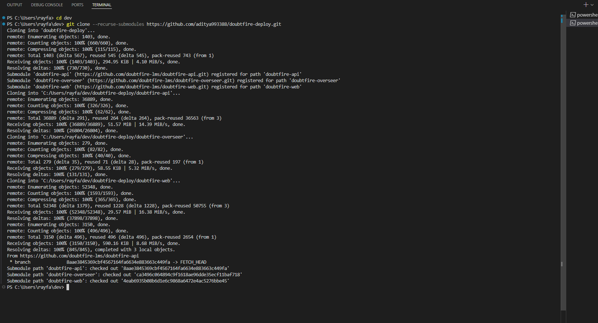

## Step 7: Open the Terminal and Navigate to Your Folder

1. Open a terminal (Command Prompt, PowerShell, or Terminal).
2. Use the `cd` command to navigate to the folder where you want to store the repository. Example:

```bash
cd dev
```

---

## Step 8: Clone the Repository

Clone the `doubtfire-deploy` repository along with its submodules:

```bash
git clone --recurse-submodules https://github.com/<your-username>/doubtfire-deploy.git
```

Replace `<your-username>` with your GitHub username. Example:

```bash
git clone --recurse-submodules https://github.com/aditya993388/doubtfire-deploy.git
```

---

## Step 9: Wait for the Cloning Process

The terminal will display the cloning progress for the repository and its submodules (e.g.,
`doubtfire-api`, `doubtfire-overseer`, `doubtfire-web`). Wait until the process completes.

---

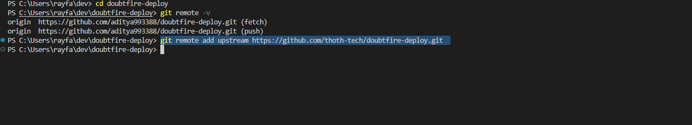

## Step 10: Navigate into the Cloned Repository

Navigate into the cloned repository:

```bash
cd doubtfire-deploy
```

---

## Step 11: Check Current Remote Settings

Verify the current remote settings:

```bash
git remote -v
```

Ensure only the `origin` is set, pointing to your forked repository.

---

## Step 12: Add the Upstream Remote

Add the upstream remote to point to the Thoth-Tech repository:

```bash
git remote add upstream https://github.com/thoth-tech/doubtfire-deploy.git
```

This ensures that upstream points to the Thoth-Tech version, not the original LMS repository.

---

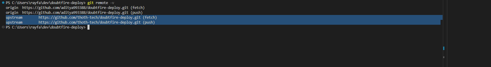

## Step 13: Verify Remote Settings

Verify the upstream remote setup:

```bash
git remote -v
```

Ensure both `origin` and `upstream` are listed correctly:

- **Origin**: Points to your forked repository.
- **Upstream**: Points to Thoth-Tech’s repository.

---

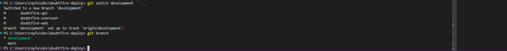

## Step 14: Switch to the Development Branch

By default, the repository is on the `main` branch. Switch to the `development` branch:

```bash
git switch development
```

Verify the switch by running:

```bash
git branch
```

The `*` symbol next to `development` confirms you are on the correct branch.

---

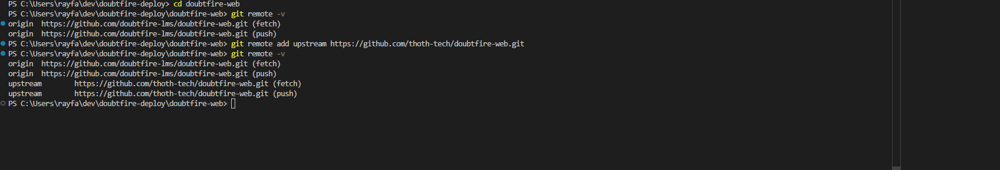

### Step 15: Navigate to the Front-End Repository

- Change your directory to the `doubtfire-web` sub-repository:
  ```bash
  cd doubtfire-web
  ```

---

### Step 16: Check Current Remote Settings

- Use the following command to view the current remote settings:

  ```bash
  git remote -v
  ```

  - You should see `origin` pointing to the forked repository.

---

### Step 17: Add the Upstream Remote

- Add the upstream remote to point to the Thoth-Tech repository:
  ```bash
  git remote add upstream https://github.com/thoth-tech/doubtfire-web.git
  ```

---

### Step 18: Verify the Upstream Remote

- Run the following command again to confirm the upstream remote is configured correctly:

  ```bash
  git remote -v
  ```

  - Ensure both `origin` and `upstream` are set properly.

---

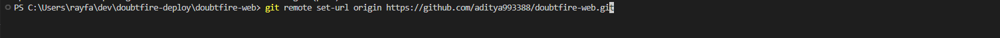

### Step 19: Update the Origin Remote URL

- Update the `origin` to point to your forked repository:

  ```bash
  git remote set-url origin https://github.com/aditya993388/doubtfire-web.git
  ```

  - This ensures that all your changes and pushes will go to your forked repository.

---

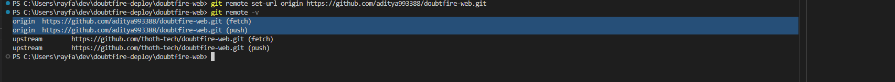

### Step 20: Verify Updated Remote URLs

- Run the following command to check the updated remote settings:

  ```bash
  git remote -v
  ```

  - Verify the following:
    - **Origin**: Points to your forked repository
      (`https://github.com/aditya993388/doubtfire-web.git`).
    - **Upstream**: Points to the Thoth-Tech repository
      (`https://github.com/thoth-tech/doubtfire-web.git`).

---

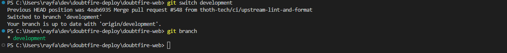

### Step 21: Switch to the Development Branch for doubtfire-web

- Ensure you are working on the correct branch by switching to the `development` branch:
  ```bash
  git switch development
  ```
- Verify the branch by using:

  ```bash
  git branch
  ```

  - The `*` symbol next to `development` confirms you are on the correct branch.

### Step 22: Pull the Latest Updates for `doubtfire-web`

- After switching to the `development` branch, pull the latest updates from the repository to ensure
  you have the most recent changes:

  ```bash
  git pull
  ```

  - This fetches and merges all updates from the `origin/development` branch.

---

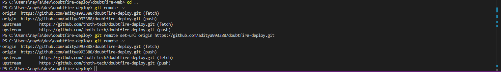

### Step 23: Update the Git Origin for `doubtfire-deploy`

- Navigate back to the `doubtfire-deploy` directory using the command:
  ```bash
  cd ..
  ```
- Check the current remote URLs with:
  ```bash
  git remote -v
  ```
- Notice that the `origin` URL might be missing the `.git` extension.
- Update the `origin` to include the `.git` extension using:
  ```bash
  git remote set-url origin https://github.com/aditya993388/doubtfire-deploy.git
  ```
- Verify the changes by running:

  ```bash
  git remote -v
  ```

  - Ensure the `origin` now points to the correct URL with the `.git` extension.

---

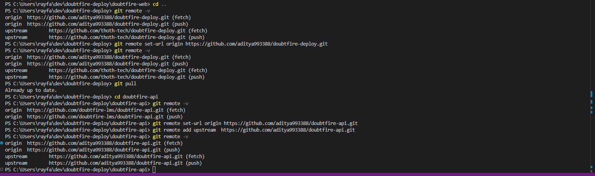

### Step 24: Perform a Git Pull and Configure Remotes for `doubtfire-api`

- Ensure the `doubtfire-deploy` repository is up-to-date by running:

  ```bash
  git pull
  ```

  - If it is already up to date, proceed.

- Navigate to the `doubtfire-api` sub-repository:
  ```bash
  cd doubtfire-api
  ```
- Check the current remote URLs with:

  ```bash
  git remote -v
  ```

  - At this stage, only the `origin` remote is configured.

- Update the `origin` to point to your version of the `doubtfire-api` repository:
  ```bash
  git remote set-url origin https://github.com/aditya993388/doubtfire-api.git
  ```
- Add the `upstream` remote to point to the Thoth-Tech version of the `doubtfire-api` repository:
  ```bash
  git remote add upstream https://github.com/thoth-tech/doubtfire-api.git
  ```
- Verify that both `origin` and `upstream` are correctly configured:

  ```bash
  git remote -v
  ```

  - Ensure `origin` points to your repository and `upstream` points to Thoth-Tech's repository.

---

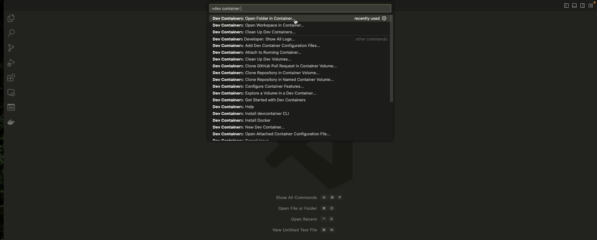

### Step 25: Accessing Dev Containers via VS Code

- Exit the terminal and open Visual Studio Code (VS Code).
- Press `Command + Shift + P` (on Mac) or `Ctrl + Shift + P` (on Windows/Linux) to open the VS Code
  Command Panel.
- In the Command Panel, search for **Dev Containers**.
- Select the option **Dev Containers: Open Folder in Container...** from the list.
- Before proceeding, ensure that Docker is running in the background.
  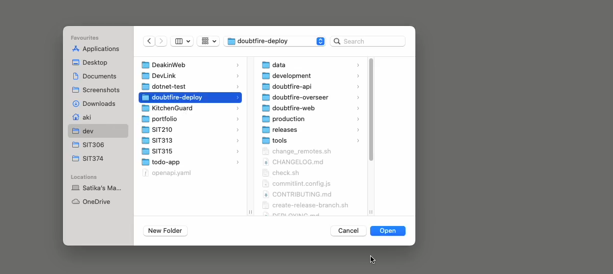

---

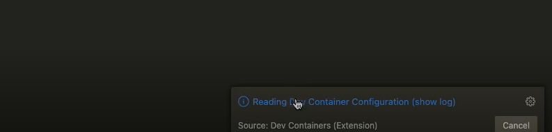

### Step 26: Reading Dev Container Configuration

- Once the folder opens in the container, look for the **Reading Dev Container Configuration (show
  log)** message in the bottom-right corner of VS Code.
- Click on **(show log)** to view the progress and ensure everything is being set up correctly.
- If it’s your first time setting up the container, expect the process to take some time as it
  configures all necessary components.

---

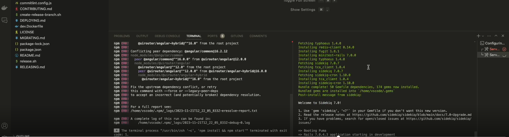

### Step 27: Running the Front-End and Back-End Applications

- At this stage, the front-end application is running on the left terminal, while the back-end
  (server) is active on the right terminal.
- Note: It's common to encounter errors during the first run of the front-end. These may relate to
  missing dependencies or configuration conflicts.
- Review the error messages carefully. For issues like dependency conflicts, try resolving them with
  appropriate commands such as `npm install` or check the error log paths mentioned in the terminal
  for further details.

---

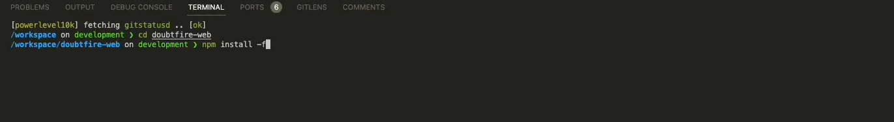

### Step 28: Navigating to `doubtfire-web` and Resolving Dependencies

- Open a new terminal window in your development environment.
- Use the command `cd doubtfire-web` to navigate into the `doubtfire-web` directory.
- Run the command `npm install -f` to forcefully install and resolve any missing dependencies for
  the front-end application.
  - This command ensures that all required packages are installed and any conflicting dependencies
    are resolved.

---

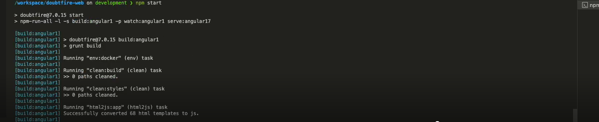

### Step 29: Run the Frontend

- Run the frontend with npm: Open a terminal in the `doubtfire-web` directory and run:

  ```bash
  npm start
  ```

  - This will build and run the frontend application. If successful, it will host the application
    locally on port `4200`. 

- Confirmation Notification: Once the frontend is running, you will see a notification in the
  bottom-right corner of your Visual Studio Code window indicating that the application is available
  on `localhost:4200`.

---

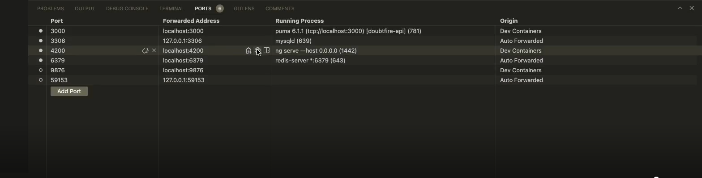

### Step 30: Verify the Running Application

- Open the **Ports Panel** in Visual Studio Code to see all forwarded ports and their statuses.
- Locate the forwarded address for port `4200`.
- Hover over the address and click on the globe icon to open the application in your default
  browser.

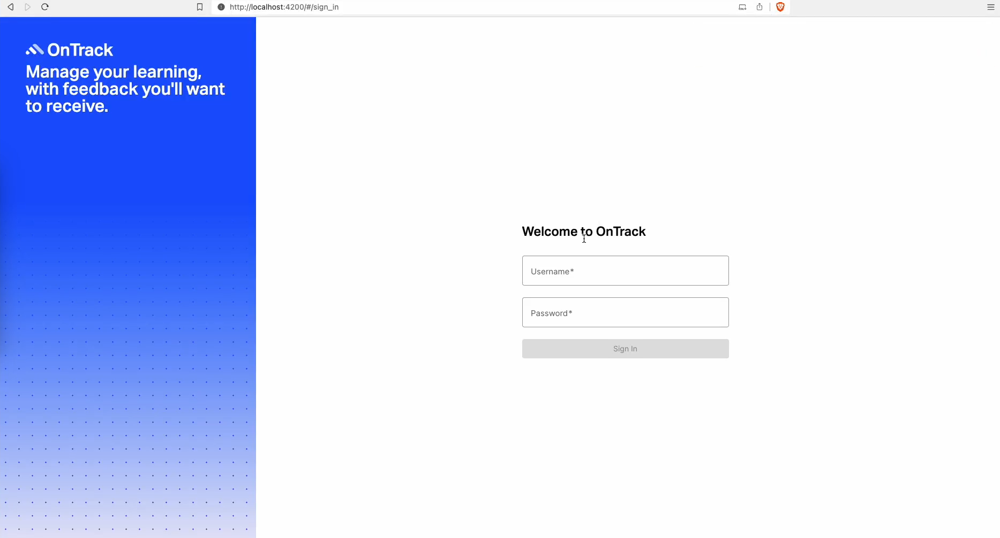

- If everything is configured correctly, the OnTrack application login page will open in your
  browser.

---

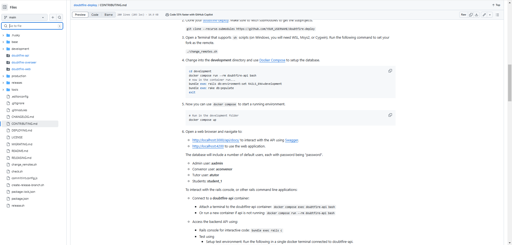

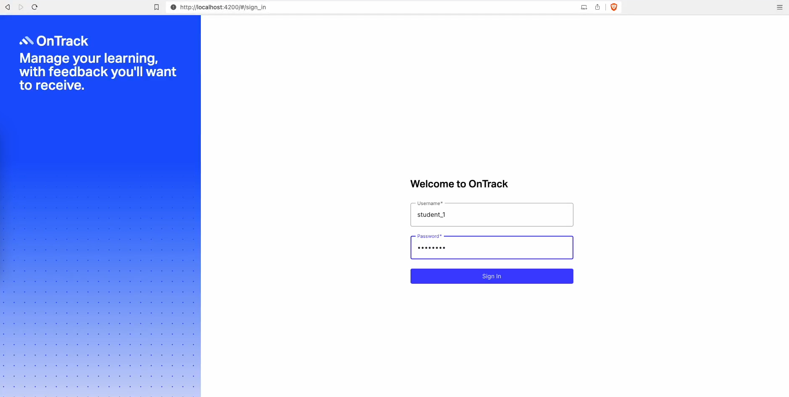

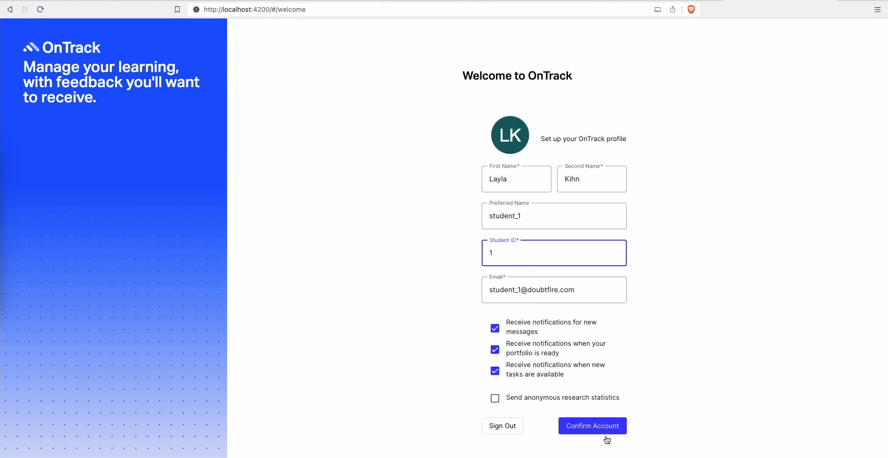

### Step 31: Log In to OnTrack

- Use the default credentials provided in the `CONTRIBUTING.md` file. Example:
  - **Username**: `student_1`
  - **Password**: Type any placeholder password as this is just for testing.
- Enter the credentials on the login page and click **Sign In** to log in successfully.

---

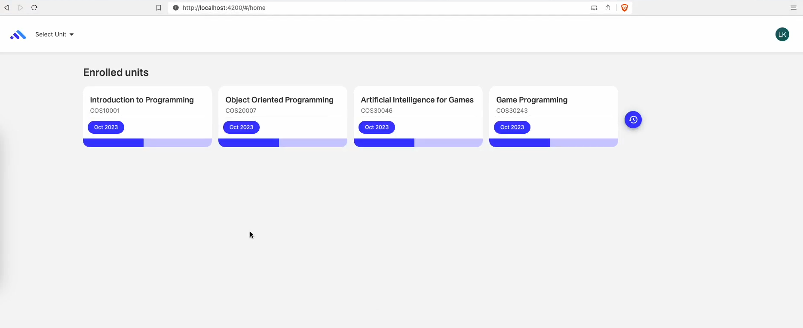

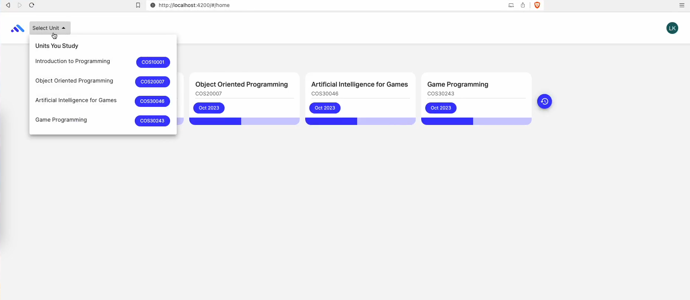

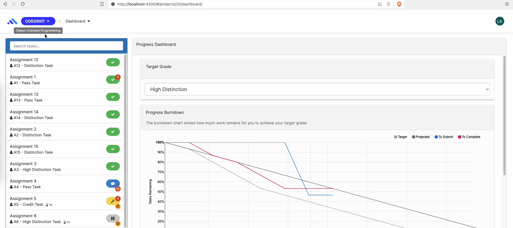

### Step 32: Exploring the Dashboard

- After logging in, you’ll be directed to the dashboard showing **Enrolled Units**. Examples:

  - Introduction to Programming
  - Object-Oriented Programming
  - Artificial Intelligence for Games
  - Game Programming

- Interact with the dashboard by:

  - Clicking on any enrolled unit to view details such as assignments and grades.
  - Using the "Select Unit" dropdown in the top-left corner to switch between units.

- **Progress Dashboard**:
  - Inside each unit, review individual assignments (e.g., Pass Tasks, Distinction Tasks).
  - Analyze your performance using tools like the **Burndown Chart**.

---

Reach out to your mentors or attend the Help-Hub for any queries.
