import { Aside } from "@astrojs/starlight/components";

## Motivation

The purpose of this document is to guide OnTrack contributors while moving previously completed work
to the `10.0.x` branch.

In 2025, development of OnTrack began to shift away from the `9.x` branch and towards the `10.0.x`
branch. However, lots of work completed by previous project teams remains completed within GitHub
but not ready to merge against `10.0.x` as it was previously opened against `9.x` or earlier
branches.

This work instruction is intended to assist those who have not previously worked with _Ruby on
Rails_, _Grape_, _Angular_, or full stack web development generally to carry out this important task
in the development of OnTrack.

## Prerequisites

It is presumed that if you're following this document, you have invested a little time into learning
basic Git, you have set up your standard local development environment, and you're willing to
troubleshoot errors as they crop up. This guide is not intended to be an exhaustive guide to every
scenario, and every rebase to `10.0.x` will have its own dependencies and quirks.

## Choosing work to rebase

Before starting, it's a good idea to make a plan and think about your goals:

- What work you are looking to rebase?
- Does this work need to be rebased to achieve your goal?
- Are there any dependencies that must be fulfilled before this work can be rebased?
- How long will it take to complete this rebase?
- Does this need to be prioritised over other development tasks?

For the purposes of this work instruction, the work done by
[@Sahiru](https://github.com/SahiruWithanage) on the _Staff Grant Extension_ feature that covers
both important submodules [_web_](https://github.com/thoth-tech/doubtfire-web) and
[_API_](https://github.com/thoth-tech/doubtfire-api) in the Doubtfire project. This feature is
completely collated in these pull requests:

- [#77](https://github.com/thoth-tech/doubtfire-api/pull/77), which contains the work done in
  [#60](https://github.com/thoth-tech/doubtfire-api/pull/60) and
  [#56](https://github.com/thoth-tech/doubtfire-api/pull/56), provides the **API** endpoint
  `StaffGrantExtension` as well as a promising notifications system amongst other improvements
- [#403](https://github.com/thoth-tech/doubtfire-web/pull/403), which contains the relevant **front
  end** work for displaying the model and allowing a user to interact with the feature

### Important note

It's important to note that most rebasing work will consist of either:

- a completed front end migration, or
- new back end in either API models or database migrations, alongside front end components that
  depend on the back end features

If you are rebasing a front end migration in `doubtfire-web`, it's probably\* safe to ignore the
`doubtfire-api` repository as any breaking changes to the API should already exist in `10.0.x`.
Matching the front end controllers to the right endpoint will be covered later in this instruction,
but will likely already be referring to the same endpoints after rebasing.

On the other hand, rebasing a feature that has both front end and back end changes will require
careful consideration. Keep in mind the requirements for both sides of the application feature as
you rebase.

## Forking the required branch(es)

After choosing work to rebase, look closely at the details of the pull request(s). The pull request
should have a source user, fork, and branch. In the following case,

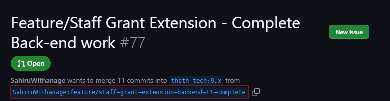

This format is `[User]:[Branch]`. To check this out in the local environment, open the directory
containing the corresponding module for the pull request. #77 is a pull request against
`doubtfire-api`, so in the VS Code terminal (or the terminal of your choice), run commands such as
the following.

```shell
cd doubtfire-api
git remote add [Name] https://github.com/[User]/doubtfire-api.git
git fetch [Name]
git checkout -b [Branch]
```

The prompt should now show a path such as `/workspace/doubtfire-api on [Branch] ❯` where branch is
the same name as the one on the pull request. In the case of Sahiru's work, the branch is called
`feature/staff-grant-extension-backend-t1-complete`:

<Aside type="tip">

The Git commands above will also set up a new local branch to track the remote branch you asked for:

```
branch 'feature/staff-grant-extension-page-merge' set up to track 'sahiru/feature/staff-grant-extension-page-merge'.
Switched to a new branch 'feature/staff-grant-extension-backend-t1-complete'
```

</Aside>

Below is an example prompt after doing this:

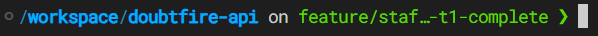

Remember that the front end work will also need to be checked out if you're doing both. Here's an
example of navigating back to the front end and checking out #403's associated branch:

```shell
cd ../doubtfire-web
git remote add sahiru https://github.com/SahiruWithanage/doubtfire-web.git
git fetch sahiru
git checkout -b feature/staff-grant-extension-page-merge
```

<Aside>The above will only work as long as Sahiru keeps their fork in GitHub.</Aside>

With both submodules now on the correct branches for this feature, it's possible to test the feature
on the local development environment. Remember the rest of the application is currently running on
`9.x`, and the goal is to make this feature work on `10.0.x`.

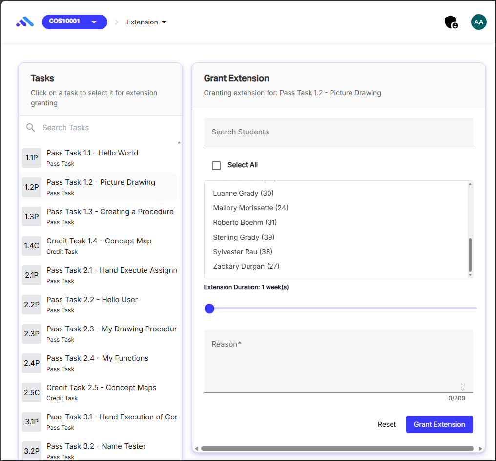

## Beginning a rebase

The first thing to do is to ensure the latest version of `10.0.x` is downloaded locally:

```shell
git fetch upstream
```

<Aside>
  This assumes `upstream` is the `thoth-tech` repository forks, as per the standard environment
  setup.
</Aside>

Now we are ready to run the rebase command!

```
git rebase upstream/10.0.x
```

This is where we start to heavily depend on the work being rebased. This work instruction will
demonstrate doing an API and a web change, and hopefully answer some questions that others face when
doing theirs.

## API rebase

The first example in this documentation will be rebasing an API branch.

### Conflicts

The most likely thing that will happen after running `git rebase` is the terminal offering a
message(s) that look like this:

```
Auto-merging [file]
CONFLICT (content): Merge conflict in [file]
error: could not apply [commit hash]
```

Followed by a hint (that is basically a TL;DR of this section) of the work instruction.

```
hint: Resolve all conflicts manually, mark them as resolved with
hint: "git add/rm <conflicted_files>", then run "git rebase --continue".
hint: You can instead skip this commit: run "git rebase --skip".
hint: To abort and get back to the state before "git rebase", run "git rebase --abort".
hint: Disable this message with "git config set advice.mergeConflict false"
```

Any files that are in conflict will receive these markers in one or more locations inside the file:

- `<<<<<<< HEAD`, which denotes the start of the code unique to the feature branch,
- `=======`, which denotes the demarcation between the conflicted code blocks,
- `>>>>>>> [commit hash]` which denotes the end of the code unique to `10.0.x`

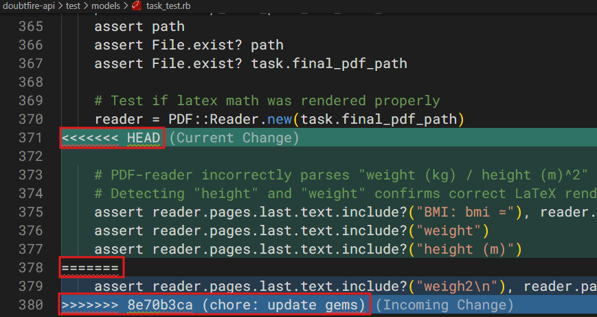

Before continuing the rebase, these markers must be removed from conflicted files, the files need to
be staged for commit, then committed as part of the rebase step. VS Code can assist this step; the
program provides features such as Merge Editor.

#### Package manifests and lockfiles

In the case of `doubtfire-api`, the most likely files to be affected by any rebase to `10.0.x` is
the `Gemfile` and `Gemfile.lock`, which are very similar to `doubtfire-web`'s `package.json` and
`package-lock.json`.

<Aside>
  `Gemfile` and `package.json` are the developer-defined files for Ruby and Node.js packages
  respectively. They are something of a human- readable manifest file for a project. Importantly for
  us, they both declare project dependencies, both have associated _lockfiles_, and both constrain
  the versions of the packages that the package manager will use when building the environment.
</Aside>

It is not important which _lockfile_ you check out. In fact, these files are best deleted and
regenerated at the end of the rebase when you've tested it is working as expected. This is because
they are generated based on the environment resolution determined by, in the case of
`doubtfire-api`, Bundler (Ruby's package manager) after the installation of the packages defined in
`Gemfile`.

```shell
git checkout Gemfile.lock --theirs  # Take the upstream lockfile
# OR
git checkout Gemfile.lock --ours  # Take the feature's lockfile
```

On the other hand, you **do** have to worry about `Gemfile` in the case of the API submodule. This
needs to be carefully changed to ensure any branch dependencies are brought across in the rebase.
This will heavily depend on what you are bringing over.


In the above screenshot, it is clear that the version of Ruby being run on `10.0.x` is in question.
Updates to such a core system may not be a good idea without careful change management. You can
always go and check the upstream branch on GitHub to see what version is running:

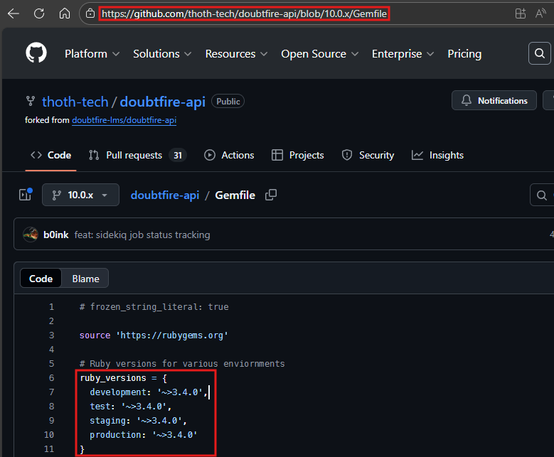

Looks like we can safely move forward with 3.4.0. Remove anything between and including the markers
`=======` and `>>>>>>> [commit hash]`, as well as the line `<<<<<<< HEAD` to keep the feature
branch's changes.

With that completed, stage both `Gemfile` and `Gemfile.lock` for committing.

### Committing changes

```shell
git add Gemfile Gemfile.lock
git commit
```

When running `git commit`, unless you have configured `git config --global core.editor` you will be
presented with either Vi (VSCode, Linux, Mac) or Vim (Git for Windows) to write a commit message.
[You can learn more about using Vi here (Recommended)](https://ryanstutorials.net/linuxtutorial/cheatsheetvi.php).
[You can learn about changing `core.editor` here](https://git-scm.com/book/en/v2/Customizing-Git-Git-Configuration#core.editor).

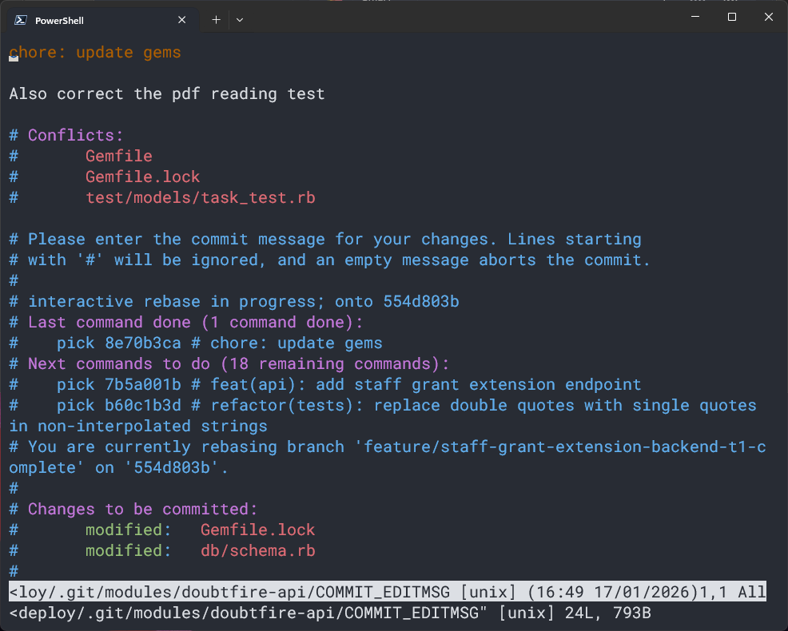

All sorts of helpful information about the rebase in progress will be displayed in the terminal. In
the example above, we can see that 1 of 19 commands have been completed in the rebase. It displays
conflicts that were found, changed files that are being committed, and which commit hashes are
getting applied next.

If required, you can add more context to the commit message (first line) or the body (3rd line and
below). Try using [Conventional Commits](https://www.conventionalcommits.org/en/v1.0.0/). In most
cases during a rebase, you will not need to change the commit details.

If you're using the default Vi-based editor, type `:wq` to save and quit the commit message and
finalise the commit. Then, use the following command to continue the rebase:

```shell
git rebase --continue
```

### Ruby files

Merging changes within Ruby files will require some knowledge about object-oriented programming, the
Rails conventions
[(watch an excellent tutorial series by Typecraft here)](https://www.youtube.com/watch?v=dtfH5h0uc6Y),
and careful understanding of the intention of the author of the code.

We will start with an easy one:

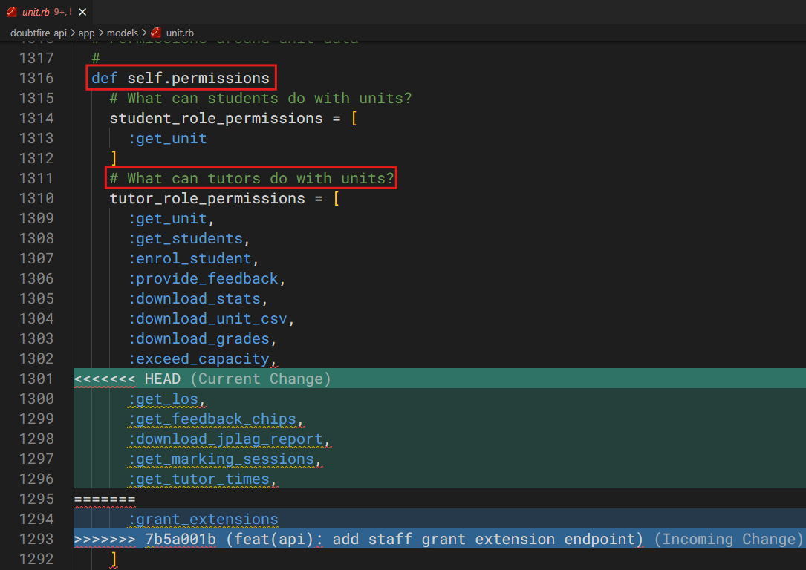

This conflict presented itself in `app/models/unit.rb`. Since you studied the recommended tutorial
above, you understand that this _model_ file is making the data within the unit table in the
database available to the Rails application. However, the only thing that needs to be changed here
is a list that defines permissions for a tutor.

Searching the codebase for `:grant_extension` reveals that it is only otherwise referenced in the
`app/services/extension_service.rb` file, which defines the Ruby service for this function.
Additionally, the value is only used as an argument that is passed to the `authorise?` function -
part of the `authorisation_helpers.rb` file:

```ruby
def authorise?(user, object, action, perm_get_fn = method(:get_permission_hash), other = nil)
    # Can pass in instance or class
    obj_class = object.class == Class ? object : object.class

    role_obj = object.role_for(user)

    return false if role_obj.nil?

    # Attempt to get the unit role from a Unit context
    unit_role = object&.unit_role_for(user) if object.respond_to?(:unit_role_for)

    # Attempt to get the unit role if object has a unit reference
    if unit_role.nil? && object.respond_to?(:unit)
      unit_role = object.unit.unit_role_for(user)
    end

    if !unit_role.nil? && unit_role.observer_only && !OBSERVER_ONLY_PERMISSIONS.include?(action)
      return false
    end

    role = role_obj.to_sym
    perm_hash = obj_class.permissions
    perms = perm_get_fn.call(role, perm_hash, other)

    # No permissions, default to false authorise, else check if the action
    # is in the permissions hash
    perms.nil? ? false : perms.include?(action)
  end
```

This function checks to see if a specific `user` can perform a specific `action` (of which
`:grant_extension` is) for a specific `object`, which in the case of `extension_service.rb` is
always a `project.unit` object - how the application defines a "unit".

Understanding all of that context, we determine that for this merge conflict, **we should keep both
changes**, as only permissions for a unit are being added or removed here. This means removing all
three conflict markers and keeping the rest.

### `db/schema.rb` and migration files

If you are rebasing something that changes the database, you will certainly some across a conflict
with this file. `schema.rb` in Rails is spiritually very similar to a _lockfile_. It is the end
result of the command `rails db:migrate` - Rails will auto-generate the file after all _database
migrations_ have run. When resolving `schema.rb` conflicts during a rebase, it's best to stick to
the same strategy as _lockfiles_.

<Aside type="caution">
  Stick to either `--theirs` or `--ours` for the entire rebase. The database schema can be updated
  later with `rails db:migrate`.
</Aside>

```shell
git checkout db/schema.rb --theirs  # Take the upstream lockfile
# OR
git checkout db/schema.rb --ours  # Take the feature's lockfile
```

<Aside>
A migration is a Ruby class that tells Rails how to modify the database
structure - creating tables, adding columns, renaming indexes, and so on - in a
way that can be run forward (migrate) or rolled back (rollback).

Check `db/migrate` - there are many, many migrations for this project. If you are following Ruby
convention, these files can be used to rebuild the `schema.rb` file using `rails db:migrate`.

</Aside>

<Aside type="danger">
  Do not attempt to rebuild Doubtfire's `schema.rb` using `rails db:drop db:create db:migrate`. Some
  of this projects' migrations are missing or otherwise unsafe to run in newer versions of Rails.
  While this goes against Ruby convention, so does modifying old migration files. Both should be
  avoided.
</Aside>

### Features not present in `10.0.x`

When evaluating a changed Ruby file, ensure you aren't accidentally including a reference to a file
that doesn't exist upstream. In the below example, the `9.x`-based branch is referencing an API
endpoint called _LearningAlignmentApi_ that doesn't yet appear to be present in `10.0.x`:


Indeed, the upstream branch is missing the file path:

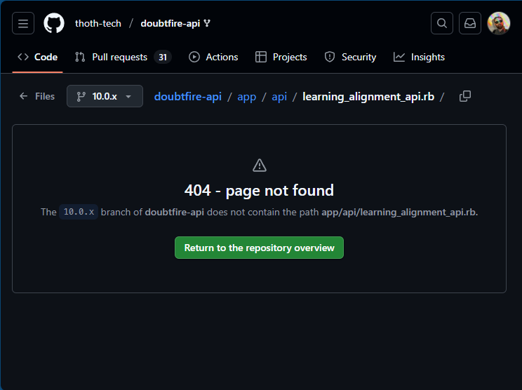

So what to do? It is probably best to leave it there, commented out, with an additional comment
mentioning that this endpoint is available in `9.x` but has not yet been ported to `10.0.x`.

```ruby
mount LearningOutcomesApi
# mount LearningAlignmentApi
# the mount above is available in 9.x but has not been ported to `10.0.x`
mount NotificationsApi
mount ProjectsApi
```

### Completing an API rebase

If you made it to the end of your rebase - there are no further commit hashes to apply to the old
work - the first thing you should try to do is run the Rails landing page. On your development
environment this is probably `localhost:3000` from a modern web browser, assuming your _Formatif
devcontainer_ is running in Docker.

If you had any `schema.rb` conflicts, now is the time you will likely encounter an error about
pending migrations:

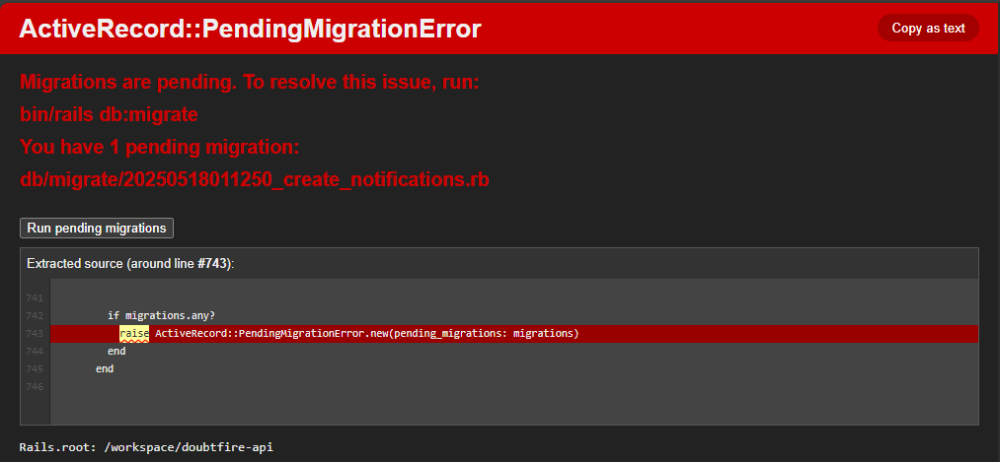

Now is the time to run `rails db:migrate` **from your development containers' terminal**. If you are
running your session from VSCode, this is easy enough to do by opening a new terminal:

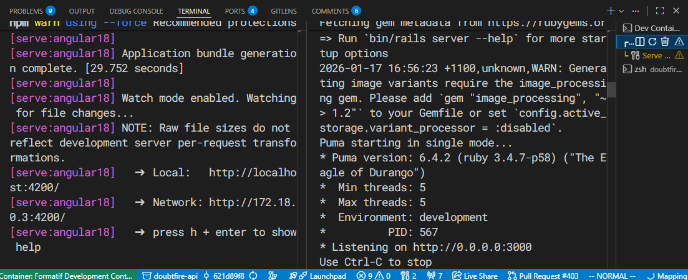


<Aside>
  If you run into an error when trying to run `rails db:migrate`, make sure that you have also run
  `cd doubtfire-api` beforehand (this was not captured in the above image)
</Aside>

Once any migrations have been run, it's a good idea to restart the server process:

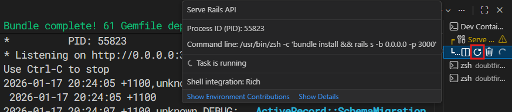

Navigating to `localhost:3000` should now show you the Rails page, but if it does not, use your
troubleshooting prowess to try and understand what has gone wrong.

## Web rebase

The second example in this documentation will be rebasing a Web branch.

### Conflicts

#### `doubtfire.states.ts`

Ensure any imports you add to this file are found in the `10.0.x` branch. Follow each of the imports
in this file to the corresponding subdirectory and file within the `src/app/` directory.

Likewise, ensure any exports from this file are:

1. Defined in the file as constants, and
2. Listed in the exports at the bottom of the file.

#### `doubtfire-angularjs.module.ts`,

This file links to each of the javascript files that will be compiled from `.coffee` files that
exist within the `/src/app` directory. These represent _unmigrated components_ that have not yet
made the jump from AngularJS to Angular17. Any migrated components that do not exist in `10.0.x`
will need to be removed from this file.

#### `doubtfire-angular.module.ts`

This file links to new Angular components. If lines are added or removed from here, make sure the
components reflect a similar reality in `10.0.x`.

For the most part, the best idea is to keep any new lines for this file. If there are problems later
introduced by having any specific line, those may require deeper analysis and commenting.
