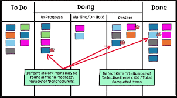
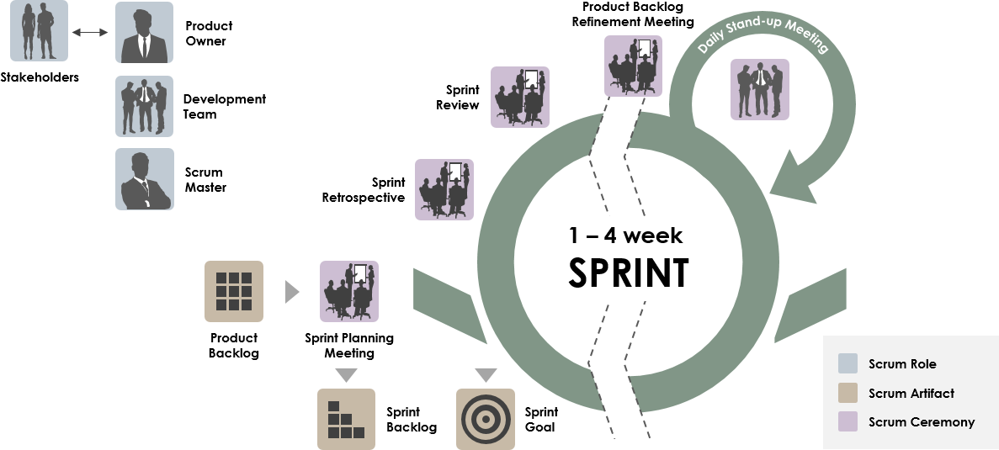

import { Steps } from "@astrojs/starlight/components";

## Overview

Planner Boards are a vital part of managing tasks and ensuring smooth workflow in OnTrack projects.
This guide will walk you through how to work with Planner Boards, understand sprints, update task
cards, and maintain clarity on the importance of upstream reviews.

## Why Planner Boards Matter

Planner Boards play a crucial role in:

- Reducing confusion about task updates and deadlines.
- Helping teams organize and prioritize work during sprints.
- Creating a transparent and collaborative environment for Agile development.
- Addressing common struggles with understanding sprints and timelines.

## How to Work with Planner Boards

Planner Boards are used to visually track the status of tasks throughout a sprint. Here’s how you
can work with them effectively:

- **Columns**: Typically, boards have columns like _To Do_, _In Progress_, _Review_, and _Done_.
  Each task card moves from left to right as work progresses.
- **Task Cards**: Represent individual tasks or stories. Cards include details like task
  description, deadlines, and assignees.
- **Agile Focus**: Use the Planner Board to reflect the Agile methodology by splitting larger
  stories into smaller, actionable tasks.

<Steps>
  <ol>
    <li>
      Open the Planner Board for your sprint. Click on <strong>Add Task</strong> and provide a clear
      title and description. Assign the task to a team member and set a due date. 
    </li>
    <li>
      Drag and drop task cards to the appropriate column (*To Do*, *In Progress*, *Review*, *Done*).
      Update the card’s status whenever significant progress is made. 
    </li>
    <li>
      Use Agile Cards to split work into smaller tasks for better sprint management. Add clear
      labels (e.g., *Bug Fix*, *Feature*, *Testing*) to indicate the nature of the task.
    </li>
  </ol>
</Steps>

---

## How Sprints Work and Their Timelines

Sprints are short, time-boxed periods where a specific set of tasks is completed. OnTrack follows
Agile principles to organize work into sprints.

### Key Points About Sprints

- **Sprint Duration**: Usually 1–2 weeks, depending on project complexity.
- **Sprint Planning**: Conduct a meeting before each sprint to assign tasks and prioritize work.
- **Sprint Review**: At the end of a sprint, review completed work and gather feedback.

### Sprint Workflow on Planner Boards

1. **Before the Sprint**:

   - Plan tasks and create cards in the _To Do_ column.
   - Prioritize tasks based on team capacity and project goals.

2. **During the Sprint**:

   - Move cards from _To Do_ → _In Progress_ → _Review_ as work progresses.
   - Communicate regularly during daily stand-ups to ensure alignment.

3. **After the Sprint**:
   - Move completed cards to the _Done_ column.
   - Archive old boards and set up a new board for the next sprint.

---

## How to Update Task Cards

Keeping task cards up-to-date is essential to ensure transparency and progress tracking.

### Steps to Update a Task Card:

1. Open the task card you want to update.
2. Edit the following fields if necessary:
   - **Status**: Update to reflect the current phase (e.g., _In Progress_, _Review_).
   - **Assignee**: Reassign the task if the original assignee changes.
   - **Description**: Add additional details or changes made.
   - **Attachments**: Upload relevant files, like designs, test cases, or documentation.
3. Save the changes and notify team members if updates require their attention.

---

## Reducing Confusion: Why and How to Update the Planner Board

Proper use of the Planner Board eliminates misunderstandings regarding task ownership, deadlines,
and sprint goals. Here's why updating is critical:

- **Transparency**: Keeps everyone informed about task progress.
- **Accountability**: Ensures team members are responsible for their assigned tasks.
- **Efficiency**: Reduces the need for repeated clarifications during meetings.

### Tips for Regular Updates:

- Schedule a daily check-in to update task statuses.
- Encourage all team members to take responsibility for keeping their cards current.
- Use tags or labels like _Blocked_, _Urgent_, or _Critical_ to highlight important tasks.

---

## Understanding Upstream Reviews

Upstream reviews ensure that pull requests (PRs) are aligned with project standards before merging.
This is closely tied to task cards in the Planner Board.

### Steps for Upstream Reviews:

1. **Connect PR to Planner Board**:

   - Link the PR to the corresponding task card for tracking.
   - Use comments in the card to summarize key changes in the PR.

2. **Review Process**:

   - Conduct a thorough code review (refer to the Peer Review Guide).
   - Move the task card to _Review_ after the PR is created.

3. **Finalizing**:
   - Once the PR is approved, move the card to _Done_.
   - Reflect any new insights or follow-up tasks on the Planner Board.

---

## Planner Boards Across Semesters

As OnTrack evolves, you may work with different Planner Boards in various semesters. To ensure
consistency:

- **Semester Boards**: Use separate boards for each semester to track progress and goals.
- **Agile Alignment**: Ensure that Agile Cards are utilized for consistency across all boards.
- **Archiving**: Archive old boards to declutter and maintain focus on current work.

---

By following these guidelines, you can use Planner Boards and Agile Cards effectively to stay
organized, work better as a team, and keep your project running smoothly while keeping your mentor
updated.
