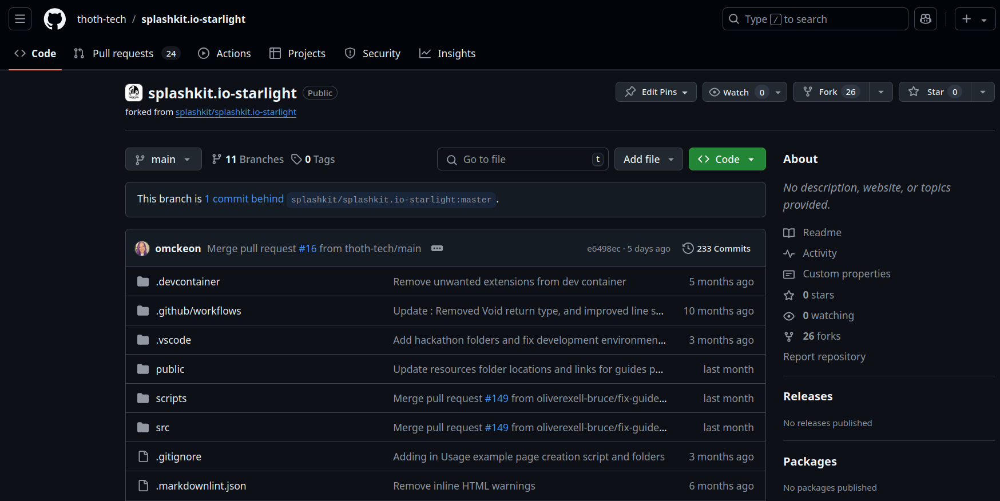
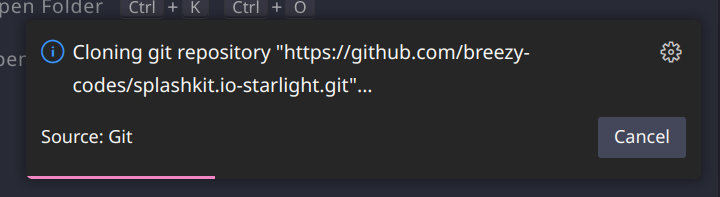
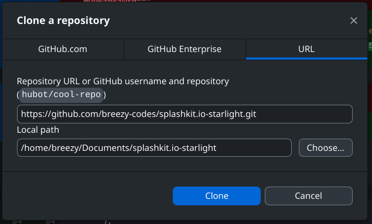
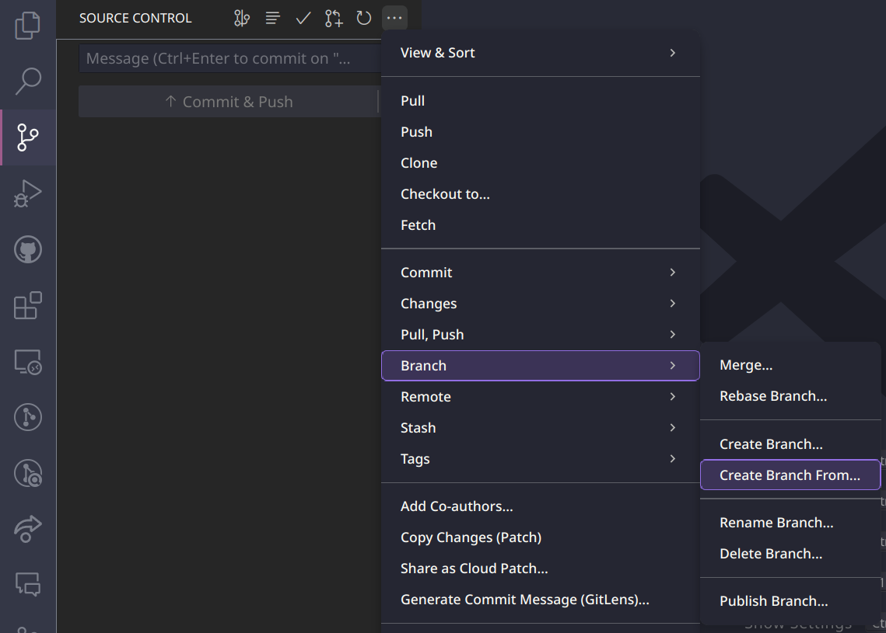
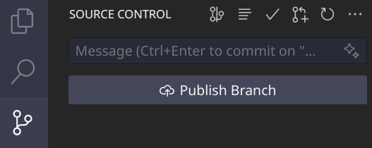
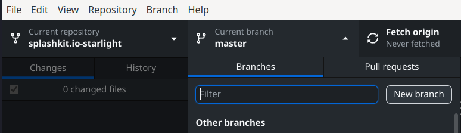
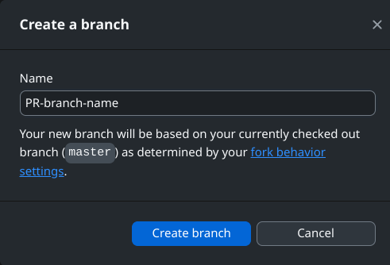
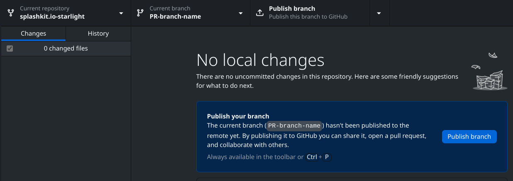

import { Steps, Aside, Tabs, TabItem } from "@astrojs/starlight/components";

## Set up a Working Environment for SplashKit

Here's a step-by-step guide on how to set up a working environment for SplashKit with GitHub

### 1. Install Git

First step is to ensure you have the necessary tools installed on your workspace. Follow the guide
in the [setting up](/products/splashkit/02-setting-up) section and then proceed to step 2

### 2. Fork a GitHub Repository

- Log in to GitHub: Go to [GitHub](https://github.com/) and log in with your details.

- Find the Repository:

  Navigate to the appropriate repo for your team:
  - [SplashKit Website repository](https://github.com/thoth-tech/splashkit.io-starlight).
  - [SplashKit Online repository](https://github.com/thoth-tech/splashkit-online).
  - [SplashKit Core repository](https://github.com/thoth-tech/splashkit-core).
  - [Thoth-Tech Documentation Site repository](https://github.com/thoth-tech/ThothTech-Documentation-Website).

  

- Fork the Repo: Click the "Fork" button at the top right of the repository page and create a new
  fork of the repository. 

### 3. Clone the Forked Repository

<Aside>
SplashKit Core cloning is slightly different! Make sure you follow the right method below
</Aside>
<Tabs>
<TabItem label="Website">
<Tabs syncKey="github-management">
<TabItem label="Via CLI">

<Steps>

1. Open a terminal on your machine and run the following commands, making sure to replace `USERNAME`
   with your own GitHub username:

   ```shell
   git clone https://github.com/USERNAME/splashkit.io-starlight.git
   ```

2. Then, navigate into the directory:

   ```shell
   cd splashkit.io-starlight
   git remote add upstream https://github.com/thoth-tech/splashkit.io-starlight.git
   ```

3. Now you're all set up to start working on the SplashKit.io repo.

</Steps>

</TabItem>
<TabItem label="Via VSCode">

<Steps>

1. Open a new VSCode window.
2. Open the command palette by pressing `cmd + shift + p` (or `ctrl + shift + p` on Windows/Linux).
3. Type `git clone` and paste the URL of your forked repo.

   

4. When prompted, select the folder location where you want to clone the repo.

   

5. Once the repo is cloned, VSCode will prompt you to open the repo folder location.

   

</Steps>

Now you're all set up to start working on the SplashKit.io repo in VSCode.

</TabItem>
<TabItem label="Via GitHub Desktop">

<Steps>

1. Open GitHub Desktop and click on the `File` tab in the top-left corner, then select
   `Clone Repository`.

   

2. Here you can either filter via your existing repositories, find the forked repo, or paste the URL
   of the forked repo.

   

3. Once the repo is cloned, you can open the repo in your preferred code editor.

</Steps>

</TabItem>
</Tabs>
</TabItem>
<TabItem label="Core">
Open a WSL terminal and change directory to your home with:

```shell
cd splashkit-core
```

Note that this guide clones the repository to the home directory, but feel free to move its
location. Now initiate the clone process of your fork with:

```shell
git clone --recursive -j2 https://github.com/{user name}/splashkit-core.git
```

splashkit-core contains multiple submodules (separate repositories which splashkit-core depends
upon). The `--recursive` argument ensures that the submodules are also downloaded when calling
clone. Wait for the download to complete before continuing to the next step.

<Aside type="caution">

If the translator folder is empty, it may be due to an issue with the submodules. In an WSL
terminal, enter the following:

```shell
cd splashkit-core
git submodule update --init --recursive
```

</Aside>
</TabItem>
</Tabs>

### 6. Create a Branch for Your Work

To start contributing to the SplashKit.io repo, you'll need to create a new branch for each
contribution. This will keep your changes separate from the main branch. You can create a new branch
in a few different ways:

<Tabs syncKey="github-management">
<TabItem label="Via CLI">
Move into the SplashKit.io directory and create a new branch:

```shell
git checkout -b your-branch-name
```

Then, push the branch to your fork:

```shell
git push origin your-branch-name
```

Now you're all set up to start working on your new branch.

</TabItem>
<TabItem label="Via VSCode">

Open source control by clicking on the icon on the left-hand side of the VSCode window. Then click
on the three dots, go down to `Branch`, and select `Create Branch from`.



Then, select to make the new branch from `master` and name your branch.

 

Next, push the branch to your fork by clicking on the `Publish Branch` button in source control.



Now you're all set up to start working on your new branch.

</TabItem>
<TabItem label="Via GitHub Desktop">

Select the Starlight repo in GitHub Desktop, then click on the `Current Branch` tab and select
`New Branch`.



Name your branch and then click `Create Branch`.



Then push the branch to your fork by clicking on the `Publish Branch` button.



Now you're all set up to start working on your new branch.

</TabItem>
</Tabs>

By creating a new branch for each contribution, you can keep your changes separate from the main
branch.

### 7. Make Changes and Test

Open the files in VS Code, make your changes, and test them locally by running or building your
project. You can use the integrated terminal in VS Code to run commands, compile the code, or start
the local server.

### 8. Commit and Push Changes to GitHub

After you've made changes, save the files and commit them to your local repository.

- Check the Status of Your Changes:

  ```shell
    git status
  ```

  This will show the current state of your working directory, including staged, unstaged, and
  untracked files.

- Stage your changes for commit:

  ```shell
  git add .
  ```

- Commit Changes: Once your changes are staged, commit them with a meaningful message:

  ```shell
  git commit -m "Added my new feature"
  ```

- Pull Any Remote Changes: Before pushing, ensure your local repository is up-to-date with the
  latest changes from the main branch:

  ```shell
  git pull origin main
  ```

- Push the changes to your forked repository:

  ```shell
    git push origin <branch-name>
  ```

  Replace `<branch-name>` with the name of your branch.

### 9. Create a Pull Request (PR)

After pushing your changes, you can create a Pull Request to propose your changes to the original
repository.

- Navigate to your forked repository on GitHub.
- Create a Pull Request: There should be an option to "Compare & pull request." Click it, review
  your changes, and submit the pull request.

Please refer to the [Pull Request Guide](/products/splashkit/04-pull-request/) for more information
on creating a pull request.

### Contributing

You should now have everything you need to begin contributing to you team.

Be sure to check out the CONTRIBUTE.md for your team:

- [Website](https://github.com/thoth-tech/splashkit.io-starlight/blob/main/CONTRIBUTE.md)
- [Online](https://github.com/thoth-tech/splashkit-online/blob/main/README.md)
- [Core](https://github.com/thoth-tech/splashkit-core/blob/develop/CONTRIBUTING.md)

---

## Troubleshooting

A lot can go wrong when working within repositories, the following guide contains a few
troubleshooting steps you can take to resolve the most common issues.

<Aside type="tip">
  You can also check the [GitHub Git Cheat
  Sheet.](https://education.github.com/git-cheat-sheet-education.pdf)
</Aside>

### How to rebase your branch

<Steps>

1. #### Fetch the Latest Changes from Upstream

   First, fetch the latest changes from the upstream repository to ensure your local copy is
   up-to-date.

   ```shell
   git fetch upstream
   ```

   This command fetches the latest branches and commits from the upstream repository without
   modifying your local working directory.

2. #### Check Out the Branch You Want to Rebase

   Make sure you’re on the branch that you want to rebase. Use the following command to switch to
   your branch:

   ```shell
   git checkout <your-branch-name>
   ```

   Replace `<your-branch-name>` with the name of your branch.

3. #### Rebase Your Branch onto the Latest `main` (or another target branch)

   To rebase your branch onto the latest changes from the upstream `main` branch (or whatever branch
   you want to base your changes on):

   ```shell
   git rebase upstream/main
   ```

   This command applies your branch’s commits on top of the latest changes from the upstream `main`
   branch. If you are rebasing onto a different branch (like `development`), replace `main` with the
   appropriate branch name.

4. #### Resolve Conflicts (if necessary)

   If there are any conflicts, Git will pause the rebase process and prompt you to resolve them. To
   see which files are in conflict, run:

   ```shell
   git status
   ```

   Manually resolve conflicts in your files, then add them to the staging area:

   ```shell
   git add <file-name>
   ```

   Once all conflicts are resolved, continue the rebase process:

   ```shell
   git rebase --continue
   ```

   If you want to abort the rebase and return to the state before the rebase began:

   ```shell
   git rebase --abort
   ```

5. #### Push the Rebasing Changes to Your Fork

   Once the rebase is complete, you need to force push the changes to your fork, as the history has
   been rewritten:

   ```shell
   git push --force-with-lease origin <your-branch-name>
   ```

   The `--force-with-lease` option ensures that you don't accidentally overwrite someone else’s
   changes in case they pushed while you were rebasing.

6. #### Verify the Rebasing

   You can now verify that your branch is rebased and up to date with the upstream changes:

   ```shell
   git log
   ```

   This will show the commit history, allowing you to confirm that your commits are on top of the
   latest upstream changes.

   By following these steps, you will have successfully rebased your branch onto the latest `main`
   branch (or whichever branch you're targeting) from the upstream repository.

</Steps>

### How to resolve conflicts during a rebase or merge

---

<Steps>

1. #### Identify Conflicts

   During a rebase or merge, if Git detects conflicts that it cannot resolve automatically, it will
   pause the process and display a message indicating which files have conflicts. You can check the
   status to identify which files are in conflict:

   ```shell
   git status
   ```

   Git will show the files that are in conflict and need your attention. Conflicted files will
   appear under the `both modified` section.

2. #### Open the Conflicted Files

   Open the conflicted files in your preferred text editor (e.g., vscode). In the file, you will see
   conflict markers that look like this:

   ```plaintext
   <<<<<<< HEAD
   // Code from your current branch
   =======
   /* Code from the branch you are rebasing or merging */
   >>>>>>> branch-name
   ```

   - **`HEAD`** contains the changes from your current branch.
   - The **`=======`** separates the two conflicting versions.
   - The text below the `=======` represents changes from the branch you are merging or rebasing
     onto.

3. #### Manually Resolve the Conflicts

   To resolve the conflict, decide whether to keep your changes, the incoming changes, or a
   combination of both.
   - **Keep your changes**: Delete the lines between `=======` and `>>>>>>>` and remove the conflict
     markers.
   - **Keep the incoming changes**: Delete the lines between `<<<<<<< HEAD` and `=======` and remove
     the conflict markers.
   - **Combine both changes**: Modify the conflicting section to include both sets of changes, based
     on your needs, and then remove the conflict markers.

   After resolving the conflicts, the file should look clean and without any conflict markers.

4. #### Mark the Conflicts as Resolved

   Once you have resolved the conflicts in a file, you need to add the file to the staging area to
   let Git know that the conflict has been resolved:

   ```shell
   git add <file-name>
   ```

   Repeat this for all the conflicted files.

5. #### Continue the Rebase or Merge Process

   Once all conflicts are resolved and staged, you can continue the process.
   - If you are in the middle of a **rebase**, continue with:

     ```shell
     git rebase --continue
     ```

   - If you are in the middle of a **merge**, finalize the merge with:

     ```shell
     git merge --continue
     ```

   If at any point you want to abort the rebase or merge due to complications, you can use the
   following command:

   ```shell
   git rebase --abort
   ```

   or

   ```shell
   git merge --abort
   ```

6. #### Push the Resolved Changes

   After resolving the conflicts and completing the rebase or merge, you will need to push the
   changes back to your remote repository. If you performed a rebase, you will need to force-push
   the branch since the commit history has been rewritten:

   ```shell
   git push --force-with-lease origin <your-branch-name>
   ```

   If it was a merge, a normal push will suffice:

   ```shell
   git push origin <your-branch-name>
   ```

7. #### Verify Everything

   After pushing, you can verify that everything is resolved and the history is clean:

   ```shell
   git log
   ```

   This will show the commit history, confirming that your conflicts were successfully resolved.

</Steps>
