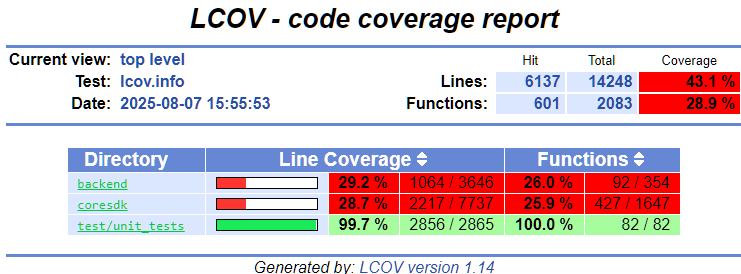
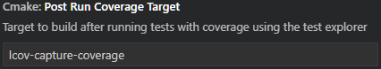
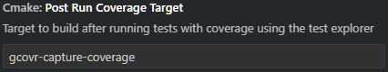

import { Steps, Tabs, TabItem } from "@astrojs/starlight/components";

Code coverage provides a convenient way to see what parts of SplashKit are being tested. This is helpful for checking that existing tests are adequate, as well as for locating parts of the code would be good candidates for new tests. Consider generating a code coverage report after adding a new test, to see if there are any parts of the code that aren't being executed. This can sometimes help you come up with new test cases.

## Pre-requisites

To generate code coverage reports, install the required program based on your platform:

<Tabs syncKey="platform">
  <TabItem label="Linux/WSL">
    Install lcov via your package manager e.g., `apt install lcov` (note that your Linux
    distribution may use a different package manager rather than `apt`, and you may need to `sudo`
    this command)
  </TabItem>
  <TabItem label="macOS">Install gcovr via homebrew: `brew install gcovr`</TabItem>
  <TabItem label="Windows (MSYS)">
    Code coverage is currently not supported on Windows with MSYS. Please use WSL if you're a
    Windows user.
  </TabItem>
</Tabs>

## Generating code coverage

### From the command line

<Tabs syncKey="platform">
<TabItem label="Linux/WSL">
<Steps>

1. Change to the cmake project directory  
   `cd ./projects/cmake`
2. Select the coverage configuration preset  
   `cmake --preset LinuxCoverage`
3. Build the unit test executable  
   `cmake --build build/ --target skunit_tests`
4. Capture initial coverage  
   `cmake --build build/ --target lcov-init-coverage`
5. Run the test executable  
   `../../bin/skunit_tests`
6. Capture test coverage  
   `cmake --build build/ --target lcov-capture-coverage`
7. Generate a coverage report in HTML format  
   `genhtml -o coverage-report/ build/lcov.info`
8. Open `index.html` to view the report  
   

</Steps>
</TabItem>
<TabItem label="macOS">
<Steps>

1. Change to the cmake project directory  
   `cd ./projects/cmake`
2. Select the coverage configuration preset  
   `cmake --preset macOSCoverage`
3. Build the unit test executable  
   `cmake --build build/ --target skunit_tests`
4. Run the test executable  
   `../../bin/skunit_tests`
5. Capture test coverage and generate a report in HTML format  
   `gcovr --root ../.. --filter ".*/coresdk/src/.*" --html-nested coverage-report/coverage.html`
6. Open `coverage.html` to view the report  
   

</Steps>
</TabItem>
<TabItem label="Windows (MSYS)">

Code coverage is currently not supported on Windows with MSYS. Please use WSL if you're a Windows
user.

</TabItem>
</Tabs>

### In VS Code

Note that currently code coverage reports won't display properly with versions of the CMake Tools
extension 1.21.36 and beyond. To work around this, you can install an older version of the extension
by clicking the arrow next to Install/Uninstall (depending on if you have CMake Tools installed
already) and selecting "Install Specific Version...". The latest version known to work is 1.20.53.

<Tabs syncKey="platform">
<TabItem label="Linux/WSL">
<Steps>

1. Go to the CMake Tools settings in VS Code, switch to the Workspace tab, and change the following
   settings:  
   **Coverage Info Files:**  
   Click Add Item and add `${workspaceFolder}/projects/cmake/build/lcov.info`  
     
   **Pre Run Coverage Target:** `lcov-init-coverage`  
     
   **Post Run Coverage Target:** `lcov-capture-coverage`  
   

2. Rebuild the test project, then run tests with coverage with this button  
   
3. After the tests run, the test explorer pane in VS Code should update with the coverage info:  
   

</Steps>
</TabItem>
<TabItem label="macOS">
<Steps>

1. Go to the CMake Tools settings in VS Code, switch to the Workspace tab, and change the following
   settings:  
   **Coverage Info Files:**  
   Click Add Item and add `${workspaceFolder}/projects/cmake/build/lcov.info`  
     
   **Post Run Coverage Target:** `gcovr-capture-coverage`  
   

2. Rebuild the test project, then run tests with coverage with this button  
   
3. After the tests run, the test explorer pane in VS Code should update with the coverage info:
   

</Steps>
</TabItem>
<TabItem label="Windows (MSYS)">

Code coverage is currently not supported on Windows with MSYS. Please use WSL if you're a Windows
user.

</TabItem>
</Tabs>
