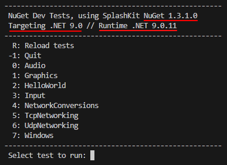

import { FileTree, Steps } from "@astrojs/starlight/components";

## Introduction

NuGet is the package manager for .NET. NuGet packages are essentially zip files containing reusable
code, libraries, and metadata. Packages can be distributed privately or publicly via NuGet
repositories. For more information, visit [nuget.org](https://www.nuget.org/).

The SplashKit NuGet package has two primary purposes:

- Provides C# bindings for SplashKit, translated from C++ using SplashKit Translator. The bindings
  allow users to create SplashKit projects with C#.
- Provides SplashKit native libraries for Windows (x64) and macOS. These libraries allow Windows and
  Mac users to create and run SplashKit projects in C# without installing the libraries separately
  via SplashKit Manager (SKM).

:::note

**Prerequisite:** Ensure [.NET SDK](https://dotnet.microsoft.com/en-us/download) is installed.

:::

## Building the Package

<Steps>

1. #### Download the SplashKit native libraries

   Download the latest stable libraries from [SKM](https://github.com/splashkit/skm.git). Libraries
   should be placed in `/tools/scripts/nuget-pkg/Libraries/win64` and
   `/tools/scripts/nuget-pkg/Libraries/macos` respectively. This step can be automated via the use
   of the bash script found at `/tools/scripts/nuget-pkg/download-libraries.sh`.

   :::note

   SKM does not include pre-compiled libraries for Linux. It instead uses a script to install
   dependencies and builds based on the detected distro.

   :::

2. #### Open the NuGet package directory

   Navigate to `/tools/scripts/nuget-pkg`. This directory contains configuration settings for the
   package, along with the associated icon and description.

3. #### Build the package

   Run one of the below commands, ensuring to replace _YOUR_VERSION_ with the relevant version
   number (e.g. 1.3.0):

   **For debug**

   ```shell
   dotnet build --configuration Debug -p:version=YOUR_VERSION-debug
   ```

   **For release**

   ```shell
   dotnet build --configuration Release -p:version=YOUR_VERSION
   ```

   This will build the package and output to `tools/scripts/nuget-pkg/bin/` as detailed in
   [Exploring the Output](#exploring-the-output).

4. #### Check the output directories
   Ensure both `Release` and `Debug` directories exist in `tools/scripts/nuget-pkg/bin/`. If either
   is missing, create the empty directory as needed. This is to ensure the test programs run without
   errors.

</Steps>

### Exploring the Output

In the `tools/scripts/nuget-pkg/bin/` directory, there will be a directory corresponding to the
built package - either `Debug` or `Release`. This directory contains the NuGet package itself
(`SplashKit.X.X.X.nupkg`), along with separate directories for each targeted .NET version. These
directories are for referencing/testing, and can be ignored - the package itself does not depend
upon them.

## Testing

A suite of test programs is provided in the form of a C# solution, with a separate project/directory
for each test.

<FileTree>

- tools
  - scripts
    - test
      - Main/
      - Directory.Build.props
      - Directory.Packages.props
      - GlobalSettings.cs
      - NuGet.config
      - NuGetTests.sln

</FileTree>

The provided tests are translations of the SplashKit core integration tests. The tests can be run
individually from their respective folders, but are best launched using the test runner located in
the `Main` directory.

:::note

For more information on SplashKit core integration tests, see
[here](https://thoth-tech.netlify.app/products/splashkit/documentation/splashkit-expansion/#building-the-test-programs).

:::

### Running the Provided Tests

<Steps>

1. #### Check local package sources

   `NuGet.config` sets the local NuGet package sources. If one of these directories does not exist,
   either create it, or comment out the corresponding entry in `NuGet.config`.

2. #### Set target package version

   `Directory.Packages.props` specifies the target NuGet package version. Update this file to match
   the version being tested.

3. #### Check target .NET versions

   `Directory.Build.props` specifies .NET versions for multi-targeting. These should match the .NET
   versions being targeted by the package build.

   :::caution

   Ensure **every** listed version of .NET is installed.

   :::

4. #### Run the test runner

   Open the `Main` directory. Run the following command, replacing _TARGET_FRAMEWORK_ with the
   framework to be tested, e.g. For .NET 9, use `dotnet run -f net9.0`.

   ```shell
   dotnet run -f <TARGET_FRAMEWORK>
   ```

   :::note

   To aid testing and ensure consistency, the test runner lists the target and runtime .NET
   framework, along with the NuGet package version. These should be checked on every run to ensure
   alignment with the intended targets:

   

   :::

5. #### Select test

   Input a number to build and run the corresponding test.

   :::caution

   **Known issue:** The included graphics test currently produces inconsistent results in a
   MSYS2/Windows environment. This behaviour is consistent with SplashKit installed via SKM and is
   being investigated.

   :::

6. #### Re-run as necessary
   To ensure the package is fully functional, the tests should be re-run to cover each combination
   of framework and architecture. Every test should produce the expected output.

</Steps>

### Updating or Adding Tests

As noted in [Running the Provided Tests](#running-the-provided-tests), the _NuGetTests_ solution
specifies the NuGet version and target frameworks in `Directory.Packages.props` and
`Directory.Build.props` respectively. These should be updated at a solution level, rather than
separate configurations for each test project. This ensures ease of use and reduces room for error.

### Adding New Tests to the Solution

<Steps>

1. Create a new directory in `/tools/scripts/test`, for example:

   ```shell
   mkdir MyTest
   ```

2. Inside the new directory, create a new project with

   ```shell
   dotnet new console
   ```

3. Edit the project's `.csproj` file to remove any `<TargetFramework>` tags, since this would
   override the solution's multi-targeting.

4. Write your new test in `Program.cs`

5. If loading resources (e.g. images, fonts, etc.) use the following line to utilise existing
   resources from the main SplashKit test suite.

   ```cs
   SetResourcesPath(GlobalSettings.ResourcePath);
   ```

</Steps>

:::note

The test runner checks the solution directory for any `.csproj` files on input. Therefore, new tests
are detected by the runner automatically, and can even be added without closing the runner.

:::

### Updating Existing Tests

Existing tests can be updated by editing `Program.cs` in the corresponding project's directory.
Since the test runner (`Main`) builds each project before running, there is no need to rebuild the
runner upon updating a test. The runner is designed to be left running during updates, to speed up
development.

If loading resources (e.g. images, fonts, etc.) use the following line to utilise existing resources
from the main SplashKit test suite:

```cs
SetResourcesPath(GlobalSettings.ResourcePath);
```

### Creating Tests Outside of the Provided Solution

Normally, an end user would use `dotnet add package splashkit` to reference the SplashKit package.
However, this will default to the latest stable SplashKit version, skipping the locally built one.
Instead, do the following:

<Steps>

1. Create a new project using

   ```shell
   dotnet new console
   ```

2. Create a `NuGet.config` file in the project (or solution) directory, specifying the path to the
   target package. An example can be found in `/tools/scripts/test`.

3. Add the following to the `.csproj`, replacing _TARGET_VERSION_ with the targeted NuGet package
   version:

   ```xml
   <ItemGroup>
   <PackageReference Include="splashkit" Version="<TARGET_VERSION>" />
   </ItemGroup>
   ```

4. Add `using static SplashKitSDK.SplashKit;` to `Program.cs`

</Steps>
