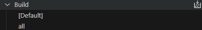

import { FileTree, Steps, Tabs, TabItem } from "@astrojs/starlight/components";

## Introduction

SplashKit uses [Catch2 2.x](https://github.com/catchorg/Catch2/tree/v2.x) as a framework for unit
tests.

Tests are written in C++ with the aid of macros from Catch2. Test files are located at:

<FileTree>

- coresdk
  - src
    - test
      - unit_test_main.cpp
      - `unit_test_<name>.cpp`

</FileTree>

`unit_test_main.cpp` is the entry point for all unit tests. You do not need to modify this to write
your own tests or update existing ones.

The `unit_test_<name>.cpp` files contain tests for related parts of SplashKit. For example,
`unit_test_utilities.cpp` has tests for SplashKit's utility functions. A test file must include the
Catch2 header file along with any other includes required:

```cpp
#include "catch.hpp"
```

## Writing a Unit Test

At a minimum, a unit test consists of a `TEST_CASE` and an assertion (usually `REQUIRE`):

```cpp
TEST_CASE("gets the number of milliseconds that have passed since the program was started", "[current_ticks]")
{
    unsigned int result = current_ticks();
    REQUIRE(result >= 0);
}
```

`TEST_CASE(name, [,tags])` defines a test case with the given name and, optionally, one or more
tags.

`REQUIRE` evaluates an expression and aborts the test as a failure if the result is false.
`REQUIRE_FALSE` is similar but fails if the expression evaluates true. There are
[other assertion macros](https://github.com/catchorg/Catch2/blob/v2.x/docs/assertions.md#top) but
these are the most common.

A test may contain multiple assertions:

```cpp
TEST_CASE("random number float between 0 and 1 is generated", "[rnd]")
{
    float result = rnd();
    REQUIRE(result >= 0);
    REQUIRE(result <= 1);
}
```

You may write tests that have some common steps, such as defining a variable. You can define one or
more `SECTION(name)` inside a `TEST_CASE`. The `TEST_CASE` is run from the start for each `SECTION`.

```cpp
TEST_CASE("return a SplashKit resource of resource_kind with name filename as a string", "[file_as_string]")
{
    const resource_kind RESOURCE = resource_kind::BUNDLE_RESOURCE;
    const string RESOURCE_PATH = "blah.txt";

    SECTION("filename is a valid file")
    {
        string result = file_as_string(RESOURCE_PATH, RESOURCE);
        string expected = "BITMAP,ufo,ufo.png\n";
        REQUIRE(result == expected);
    }
    SECTION("filename is an empty string")
    {
        string result = file_as_string("", RESOURCE);
        string expected = "";
        REQUIRE(result == expected);
    }
    SECTION("filename is an invalid file")
    {
        string result = file_as_string("invalid.txt", RESOURCE);
        string expected = "";
        REQUIRE(result == expected);
    }
}
```

This test has three `SECTION`s, so the `TEST_CASE` will run three times. Each time, the `RESOURCE`
and `RESOURCE_PATH` variables will be defined.

## Building the test project

<Tabs syncKey="platform">
<TabItem label="Linux/WSL">
<Steps>

1. Open a terminal and install prerequisites with these commands:

   ```shell
   sudo apt-get update
   sudo apt-get upgrade -y
   sudo apt-get install -y \
   git build-essential cmake g++ libpng-dev libcurl4-openssl-dev libsdl2-dev \
   libsdl2-mixer-dev libsdl2-gfx-dev libsdl2-image-dev libsdl2-net-dev libsdl2-ttf-dev \
   libmikmod-dev libbz2-dev libflac-dev libvorbis-dev libwebp-dev libfreetype6-dev
   ```

2. Install the CMake Tools extension from the VS Code extension browser or
   [here](https://marketplace.visualstudio.com/items?itemName=ms-vscode.cmake-tools).

3. Configure the extension:  
   Select `${workspaceFolder}/projects/cmake/CMakeLists.txt`  
     
   Select the Linux preset  
     
   Select the Default configure preset  
     
   In the CMake Tools extension click the button
    next to Build and select
   skunit_tests  
     
   Click the button  next to
   Debug and select skunit_tests  
   

4. Build test project:  
   From the command line:

   ```shell
   cd projects/cmake
   cmake --preset Linux
   cmake --build build/
   ```

   Or in VS Code:  
   In the CMake Tools extension, click the Build button. The test project will also be built when
   you refresh tests on the Testing tab of VS Code.  
   

</Steps>
</TabItem>
<TabItem label="macOS">
<Steps>

1. Install the CMake Tools extension from the VS Code extension browser or
   [here](https://marketplace.visualstudio.com/items?itemName=ms-vscode.cmake-tools).

2. Configure the extension:  
   Select `${workspaceFolder}/projects/cmake/CMakeLists.txt`  
     
   Select the macOS preset  
     
   Select the Default configure preset  
     
   In the CMake Tools extension click the button
    next to Build and select
   skunit_tests  
     
   Click the button  next to
   Debug and select skunit_tests  
   

3. Build test project:  
   From the command line:

   ```shell
   cd projects/cmake
   cmake --preset macOS
   cmake --build build/
   ```

   Or in VS Code:  
   In the CMake Tools extension, click Build. The test project will also be built when you refresh
   tests on the Testing tab of VS Code.  
   

</Steps>
</TabItem>
<TabItem label="Windows">
<Steps>

1. Open the MINGW64 terminal and install prerequisites with these commands:

   ```shell
   pacman -Syu
   pacman -S mingw-w64-x86_64-gcc mingw-w64-x86_64-gdb mingw-w64-x86_64-cmake mingw-w64-x86_64-make
   ```

2. Install the CMake Tools extension from the VS Code extension browser or
   [here](https://marketplace.visualstudio.com/items?itemName=ms-vscode.cmake-tools).

3. Configure the extension:  
   Select `${workspaceFolder}/projects/cmake/CMakeLists.txt`  
     
   Select the Windows preset  
     
   Select the Default configure preset  
     
   In the CMake Tools extension click the button
    next to Build and select
   skunit_tests  
     
   Click the button  next to
   Debug and select skunit_tests  
   

4. Build test project:  
   From the command line:

   ```shell
   cd projects/cmake
   cmake --preset Windows
   cmake --build build/
   ```

   Or in VS Code:  
   In the CMake Tools extension, click Build. The test project will also be built when you refresh
   tests on the Testing tab of VS Code.  
   

</Steps>
</TabItem>
</Tabs>

## Running unit tests

### From the command line

<Tabs syncKey="platform">
<TabItem label="Linux/WSL">

- It's a good idea to run the unit tests in a random order so that you can confirm that they run
  indepedently of one another:

  ```shell
  cd ../../bin
  ./skunit_tests --order rand
  ```

  By default, this will only show reports for failed tests. To show reports for successful tests as
  well, use the option `--success`. More command line options can be found in
  [Catch2's documentation](https://github.com/catchorg/Catch2/blob/v2.x/docs/command-line.md).

- If you want to run a specific test, or group of tests, you can do so:

  ```shell
  ./skunit_tests <test spec>
  ```

  The `test spec` can be a test name or tags and supports wildcards. For example, `*string*` would
  run all of the tests with "string" in the name.

</TabItem>
<TabItem label="macOS">

- It's a good idea to run the unit tests in a random order so that you can confirm that they run
  indepedently of one another:

  ```shell
  cd ../../bin
  ./skunit_tests --order rand
  ```

  By default, this will only show reports for failed tests. To show reports for successful tests as
  well, use the option `--success`. More command line options can be found in
  [Catch2's documentation](https://github.com/catchorg/Catch2/blob/v2.x/docs/command-line.md).

- If you want to run a specific test, or group of tests, you can do so:

  ```shell
  ./skunit_tests <test spec>
  ```

  The `test spec` can be a test name or tags and supports wildcards. For example, `*string*` would
  run all of the tests with "string" in the name.

</TabItem>
<TabItem label="Windows">

- It's a good idea to run the unit tests in a random order so that you can confirm that they run
  indepedently of one another:

  ```shell
  cd ../../bin
  ./skunit_tests.exe --order rand
  ```

  By default, this will only show reports for failed tests. To show reports for successful tests as
  well, use the option `--success`. More command line options can be found in
  [Catch2's documentation](https://github.com/catchorg/Catch2/blob/v2.x/docs/command-line.md).

- If you want to run a specific test, or group of tests, you can do so:

  ```shell
  ./skunit_tests.exe <test spec>
  ```

  The `test spec` can be a test name or tags and supports wildcards. For example, `*string*` would
  run all of the tests with "string" in the name.

</TabItem>
</Tabs>

### In VS Code

You can run tests from the Testing tab in VS Code


- Running all tests:  
  Click Run Tests. Each test will be run and the status of each can be seen in the test list after a
  test runs.  
  
- Running a specific test:  
  Click Run Test next to any test on the test list to run it  
    
  

## See Also

- [Catch2 tutorial](https://github.com/catchorg/Catch2/blob/v2.x/docs/tutorial.md)
- [Catch2 reference](https://github.com/catchorg/Catch2/blob/v2.x/docs/Readme.md)
