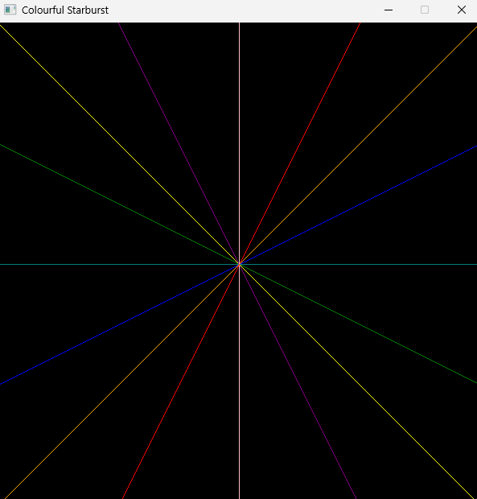

import { Steps, Tabs, TabItem } from "@astrojs/starlight/components";

## Code Style and Formatting Guide

This guide aims to introduce new team members to some standard practices for contributing to
splashkit, such as variable declarations, formatting across languages and general do's and don'ts

## Naming Conventions

These are general naming conventions for variables, functions, namespaces and more that should be
used when creating usage examples for SplashKit.

### 1. Variable declarations

Variable declarations for SplashKit usage examples should be in the following format:

| Language | Naming convention | Variable Example       |
| -------- | ----------------- | ---------------------- |
| C++      | snake_case        | `string variable_name` |
| C#       | camelCase         | `string variableName`  |
| Python   | snake_case        | `variable_name`        |

See the examples below:

<Tabs syncKey="code-language">
<TabItem label="C++">

```cpp
#include "splashkit.h"

int main()
{
    // Declare a variable with snake_case
    string variable_name = "This is snake case";
    return 0;
}
```

</TabItem>
<TabItem label="C#">

<Tabs syncKey="csharp-style">
<TabItem label="Top-level Statements">

```csharp
using static SplashKitSDK.SplashKit;

// Declare a variable with camelCase
string variableName = "this is an example of camelCase";
```

</TabItem>
<TabItem label="Object-Oriented">

```csharp
using SplashKitSDK;

namespace VariableExample
{
    public class Program
    {
        public static void Main()
        {
            // Declare a variable with camelCase
            string variableName = "this is an example of camelCase";

        }
    }
}
```

</TabItem>
</Tabs>

</TabItem>
<TabItem label="Python">

```python
from splashkit import *

# declare a variable with snake_case
variable_name = "This is snake case"

```

</TabItem>
</Tabs>

**Other guidelines when creating variables**:

| Do                                    | Don't                               |
| ------------------------------------- | ----------------------------------- |
| Use descriptive variable names        | Use `i`, `x`, `val` in main logic   |
| Use variables for multiple use values | Declare a variable for one time use |
| Use proper types for variables        | Use types such as `var` and `float` |

### 2. Function and Methods

When calling and naming functions and methods using SplashKit we do the following:

| Language             | Naming convention | Function/Method Example              |
| -------------------- | ----------------- | ------------------------------------ |
| C++                  | snake_case        | `refresh_screen(60)`                 |
| C# (Top-Level)       | PascalCase        | `RefreshScreen(60)`                  |
| C# (Object-Oriented) | PascalCase        | `SplashKit.RefreshScreen(60)`        |
| Python               | snake_case        | `refresh_screen_with_target_fps(60)` |

:::tip[Python function names]

Python function names will often differ from other languages due to python not handling function
overloads. The example above shows the difference for this overload of Refresh Screen.

You can check the correct function signature in the [API Documentation](https://splashkit.io/api/)
pages.

:::

### 3. C# Namespaces (Object-Oriented)

The namespace for a usage example in C# (Object-Oriented version) should be written in Pascal case,
and will follow the convention of: The name of the function being demonstrated, with the word
"Example" added on the end, also written in Pascal case.

**For example**:

```csharp
using SplashKitSDK;

namespace DrawRectangleExample
{
  // ...
}
```

### 4. Window Names

When using windows to display any graphics the window name should be a description of what is
happening on the window rather than the name of the function you are displaying.

| Good Window Name                         | Bad Window Name                        |
| ---------------------------------------- | -------------------------------------- |
| `"Colourful Starburst"`                  | `"Draw Line"`                          |
|  |  |

## Formatting, Structure and Readability

### Code Comments

Code comments should be used to explain the _why_ behind code, not the _what_. Code comments should
be clear and concise

A good Comment should explain the intent or purpose A bad comment will state the obvious

| Do                                            | Don't                                                                            |
| --------------------------------------------- | -------------------------------------------------------------------------------- |
| `// Draw rectangle to window`                 | `// Call the DrawRectangle function`                                             |
| `// Wait for user input`                      | `// Hold program to wait for user to press any key before the program continues` |
| Use comments for complex or non-obvious logic | Use comments to repeat code literally                                            |
| Use comments for group of code or code block  | Use comments for only the line below the comment                                            |

#### C# Example

**Good comment example**:

```csharp
// End the game if the player runs out of health
if (playerHealth <= 0)
{
    WriteLine("Game Over");
}
```

**Bad comment example**:

```csharp
if (playerHealth <= 0)
{
    // Call WriteLine when health reaches 0
    WriteLine("Game Over");
}
```

### Braces and Indentation

- **Braces:** Place braces (curly brackets) on the line following the declaration.
- **Indentation:** Between any new pair of curly brackets (`{`, `}`), write your code **4** further
  spaces in from the left.

**Do**:

```cpp
int main()
{
    // ...
}
```

**Don't do**:

```cpp
int main() {
  // ...
}
```

### If Statements

- The if statement condition should be on its own line.
- Use braces, even if just 1 line below, as this is easier for beginners to read.

**Do**:

```cpp
if (mouse_clicked(LEFT_BUTTON))
{
    x -= SPEED;
}
```

**Don't do**:

```cpp
if (mouse_clicked(LEFT_BUTTON)) x-= SPEED;
```

### Graphical Examples

- If your program is using a Graphical Window, any text information should be displayed on the
  Window.
- Do not use terminal outputs when using a graphics window in your program.

### Looping

- Do not use infinite loops, such as `while(true)`, as this is poor practice.
- Instead, use a loop condition that is defined by a boolean function, such as
  `while (!quit_requested())`.

### Use simple code

As SplashKit usage examples are targeted to beginners, so it's important to keep the code as simple
and readable as possible.

Avoid using advanced features such as:

- **Ternary statements/operators** (`condition ? value-if-true : value-if-false`), and instead,
  stick to traditional if/else statements.

## C# OOP vs Top Level

### Understanding the Differences Between Top-Level and OOP Styles

**Top-Level Statements**:

- Top-level statements allow you to write C# code without explicitly defining a class or `Main`
  method.
- Uses the directive: `using static SplashKitSDK.SplashKit;`, so SplashKit functions are called
  directly, such as `WriteLine("Hello!");`.

**Object-Oriented Programming (OOP)**:

- OOP-style C# code requires defining a `Main` method inside a class.
- Uses `using SplashKitSDK;`, meaning all SplashKit commands are prefixed with `SplashKit.` (e.g.,
  `SplashKit.WriteLine("Hello!");`).

### Some key differences

:::note

When converting to OOP you should try and create and use objects where possible.

:::

Some key differences to note when converting between OOP and top level statements are that OOP
should be seeking to highlight the objectivity where possible.

Note the code examples below:

```csharp
// OOP Code
using SplashKitSDK;

namespace DrawRectangleOnWindowExample
{
    public class Program
    {
        public static void Main()
        {
            Rectangle rectangle = new Rectangle { X = 100, Y = 100, Width = 100, Height = 100 };
            Window window = new Window("Example", 600, 400);

            window.Clear(Color.White);
            window.DrawRectangle(Color.Red, rectangle);
            window.Refresh();
            SplashKit.Delay(5000);
            window.Close();
        }
    }
}
```

```csharp
// Top Level Code
using SplashKitSDK;
using static SplashKitSDK.SplashKit;

Rectangle rectangle = RectangleFrom(100, 100, 100, 100);
Window window = OpenWindow("Example", 600, 400);

ClearWindow(window, ColorWhite());
DrawRectangleOnWindow(window, ColorRed(), rectangle);
RefreshWindow(window);
Delay(5000);
CloseWindow(window);
```

The two code blocks here are functionally identical, but highlight some key differences between top
level code and OOP code.

Notice in the OOP code, we create the `rectangle` and `window` objects, and then perform the drawing
of the rectangles through the objects' methods. In the top level code however we are calling
functions and passing in the object as parameters.

Another key difference here, in OOP we call the color class `Color` and specify the colour we want
via the member `Red` whereas in Top Level code we call the function `ColorRed()`.

:::tip[Using SplashKit.OpenWindow]

For examples that do not require a `Window` variable, the C# OOP code should use
`SplashKit.OpenWindow(...)` rather than `new Window(...)`.

This also applies to other SplashKit types such as Bitmaps and Fonts.

:::

---

### Converting from Top-Level Statements to OOP

To convert from top-level statements to OOP, follow these steps:

<Steps>

1. **Add a Namespace and Class**:

   Wrap your code in a namespace and class with a `Main` method.

2. **Adjust the `using` Directive**:

   Replace `using static SplashKitSDK.SplashKit;` with `using SplashKitSDK;`.

3. **Prefix SplashKit Functions**:

   Add `SplashKit.` before each SplashKit function.

</Steps>

---

#### Example Conversion

**Top-Level Code**:

```csharp
using static SplashKitSDK.SplashKit;

WriteLine("What is your name?");
string name = ReadLine();

WriteLine("Hello, " + name + "!");
```

**Converted to OOP**:

```csharp
using SplashKitSDK;

namespace WriteLineExample
{
    public class Program
    {
        public static void Main()
        {
            SplashKit.WriteLine("What is your name?");
            string name = SplashKit.ReadLine();

            SplashKit.WriteLine("Hello, " + name + "!");
        }
    }
}
```

### Converting from OOP to Top-Level Statements

To convert from OOP to top-level statements:

<Steps>

1. **Remove Namespace and Class Wrapping**:

   Delete the `namespace` and `class` definitions along with the `Main` method.

2. **Adjust the `using` Directive**:

   Replace `using SplashKitSDK;` with `using static SplashKitSDK.SplashKit;`.

3. **Remove the `SplashKit.` Prefix**:

   Directly call functions like `WriteLine()` and `ReadLine()`.

</Steps>

---

#### Example Conversion

**OOP Code**:

```csharp
using SplashKitSDK;

namespace WriteLineExample
{
    public class Program
    {
        public static void Main()
        {
            SplashKit.WriteLine("What is your name?");
            string name = SplashKit.ReadLine();

            SplashKit.WriteLine("Hello, " + name + "!");
        }
    }
}
```

**Converted to Top-Level Statements**:

```csharp
using static SplashKitSDK.SplashKit;

WriteLine("What is your name?");
string name = ReadLine();

WriteLine("Hello, " + name + "!");
```

### Quick Reference

**Top-Level to OOP**:

- Replace `using static SplashKitSDK.SplashKit;` with `using SplashKitSDK;`.
- Wrap code in:

  ```csharp
  namespace FunctionNameExample
  {
      public class Program
      {
          public static void Main()
          {
              // Code here
          }
      }
  }
  ```

  :::note[Namespace naming]

  In the namespace name, replace `FunctionName` with the name of the function, using PascalCase.

  :::

- Prefix SplashKit functions with `SplashKit.`.

**OOP to Top-Level**:

- Replace `using SplashKitSDK;` with `using static SplashKitSDK.SplashKit;`.

  :::note[Variables with SplashKit types]

  If your code has variables with a SplashKit data type, such as `Window`, `Bitmap`, etc, then you
  will need to include `using SplashKitSDK;` as well.

  You can then comment this line out, and check that only the SplashKit variables have error
  squiggles, then uncomment the line again.

  :::

- Remove `namespace`, `class`, and `Main` method wrappers.
- Remove `SplashKit.` prefixes.

Using this guide, you can quickly convert between top-level statements and OOP formats in SplashKit
tutorials, making the code accessible for different programming preferences.
