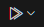

import { FileTree } from "@astrojs/starlight/components";
import { Steps } from "@astrojs/starlight/components";
import { Tabs, TabItem } from "@astrojs/starlight/components";

## Introduction

SplashKit uses [Catch2 2.x](https://github.com/catchorg/Catch2/tree/v2.x) as a framework for unit
tests.

Tests are written in C++ with the aid of macros from Catch2. Test files are located at:

<FileTree>

- coresdk
  - src
    - test
      - unit_test_main.cpp
      - unit*test*[name].cpp

</FileTree>

`unit_test_main.cpp` is the entry point for all unit tests. You do not need to modify this to write
your own tests or update existing ones.

The `unit_test_[name].cpp` files contain tests for related parts of SplashKit. For example,
`unit_test_utilities.cpp` has tests for SplashKit's utility functions. A test file must include the
Catch2 header file along with any other includes required:

```cpp
#include "catch.hpp"
```

## Writing a Unit Test

At a minimum, a unit test consists of a `TEST_CASE` and an assertion (usually `REQUIRE`):

```cpp
TEST_CASE("gets the number of milliseconds that have passed since the program was started", "[current_ticks]")
{
    unsigned int result = current_ticks();
    REQUIRE(result >= 0);
}
```

`TEST_CASE(name, [,tags])` defines a test case with the given name and, optionally, one or more
tags.

`REQUIRE` evaluates an expression and aborts the test as a failure if the result is false.
`REQUIRE_FALSE` is similar but fails if the expression evaluates true. There are
[other assertion macros](https://github.com/catchorg/Catch2/blob/v2.x/docs/assertions.md#top) but
these are the most common.

A test may contain multiple assertions:

```cpp
TEST_CASE("random number float between 0 and 1 is generated", "[rnd]")
{
    float result = rnd();
    REQUIRE(result >= 0);
    REQUIRE(result <= 1);
}
```

You may write tests that have some common steps, such as defining a variable. You can define one or
more `SECTION(name)` inside a `TEST_CASE`. The `TEST_CASE` is run from the start for each `SECTION`.

```cpp
TEST_CASE("return a SplashKit resource of resource_kind with name filename as a string", "[file_as_string]")
{
    const resource_kind RESOURCE = resource_kind::BUNDLE_RESOURCE;
    const string RESOURCE_PATH = "blah.txt";

    SECTION("filename is a valid file")
    {
        string result = file_as_string(RESOURCE_PATH, RESOURCE);
        string expected = "BITMAP,ufo,ufo.png\n";
        REQUIRE(result == expected);
    }
    SECTION("filename is an empty string")
    {
        string result = file_as_string("", RESOURCE);
        string expected = "";
        REQUIRE(result == expected);
    }
    SECTION("filename is an invalid file")
    {
        string result = file_as_string("invalid.txt", RESOURCE);
        string expected = "";
        REQUIRE(result == expected);
    }
}
```

This test has three `SECTION`s, so the `TEST_CASE` will run three times. Each time, the `RESOURCE`
and `RESOURCE_PATH` variables will be defined.

## Building the test project

<Tabs syncKey="platform">
<TabItem label="Linux/WSL">
<Steps>

1.  Open a terminal and install prerequisites with these commands:

    ```shell
    sudo apt-get update
    sudo apt-get upgrade -y
    sudo apt-get install -y \
    git build-essential cmake g++ libpng-dev libcurl4-openssl-dev libsdl2-dev \
    libsdl2-mixer-dev libsdl2-gfx-dev libsdl2-image-dev libsdl2-net-dev libsdl2-ttf-dev \
    libmikmod-dev libbz2-dev libflac-dev libvorbis-dev libwebp-dev libfreetype6-dev
    ```

2.  Install the CMake Tools extension from the VS Code extension browser or
    [here](https://marketplace.visualstudio.com/items?itemName=ms-vscode.cmake-tools).

3.  Configure the extension:  
    Select `${workspaceFolder}/projects/cmake/CMakeLists.txt`  
      
    Select the Linux preset  
      
    Select the Default configure preset  
      
    In the CMake Tools extension click the button
     next to Build and select
    skunit_tests  
      
    Click the button  next to
    Debug and select skunit_tests  
    

4.  Build test project:  
    From the command line:
    ```shell
    cd projects/cmake
    cmake --preset Linux
    ```
    Or in VS Code:  
    In the CMake Tools extension, click the Build button. The test project will also be built when
    you refresh tests on the Testing tab of VS Code.  
    

</Steps>
</TabItem>
<TabItem label="macOS">
<Steps>

1.  Install the CMake Tools extension from the VS Code extension browser or
    [here](https://marketplace.visualstudio.com/items?itemName=ms-vscode.cmake-tools).

2.  Configure the extension:  
    Select `${workspaceFolder}/projects/cmake/CMakeLists.txt`  
      
    Select the macOS preset  
      
    Select the Default configure preset  
      
    In the CMake Tools extension click the button
     next to Build and select
    skunit_tests  
      
    Click the button  next to
    Debug and select skunit_tests  
    

3.  Build test project:  
    From the command line:
    ```shell
    cd projects/cmake
    cmake --preset macOS
    ```
    Or in VS Code:  
    In the CMake Tools extension, click Build. The test project will also be built when you refresh
    tests on the Testing tab of VS Code.  
    

</Steps>
</TabItem>
<TabItem label="Windows">
<Steps>

1.  Open the MINGW64 terminal and install prerequisites with these commands:

    ```shell
    pacman -Syu
    pacman -S mingw-w64-x86_64-gcc mingw-w64-x86_64-gdb mingw-w64-x86_64-cmake mingw-w64-x86_64-make
    ```

2.  Install the CMake Tools extension from the VS Code extension browser or
    [here](https://marketplace.visualstudio.com/items?itemName=ms-vscode.cmake-tools).

3.  Configure the extension:  
    Select `${workspaceFolder}/projects/cmake/CMakeLists.txt`  
      
    Select the Windows preset  
      
    Select the Default configure preset  
      
    In the CMake Tools extension click the button
     next to Build and select
    skunit_tests  
      
    Click the button  next to
    Debug and select skunit_tests  
    

4.  Build test project:  
    From the command line:
    ```shell
    cd projects/cmake
    cmake --preset Windows
    ```
    Or in VS Code:  
    In the CMake Tools extension, click Build. The test project will also be built when you refresh
    tests on the Testing tab of VS Code.  
    

</Steps>
</TabItem>
</Tabs>

## Running unit tests

### From the command line

<Tabs syncKey="platform">
<TabItem label="Linux/WSL">

- Running all tests:

  ```shell
  cd ../../bin
  ./skunit_tests
  ```

  Example output:

  ```
  (14/04/2025) ERROR -> Invalid binary string passed to bin_to_oct: 2, returning empty string [raised in basics.cpp:340]
  (14/04/2025) ERROR -> Invalid hexadecimal string passed to hex_to_oct: G, returning empty string [raised in basics.cpp:371]
  (14/04/2025) ERROR -> Invalid octal string passed to hex_to_dec: G, returning 0 [raised in basics.cpp:305]
  (14/04/2025) ERROR -> Invalid octal string passed to oct_to_hex: 8, returning empty string [raised in basics.cpp:383]
  ===============================================================================
  All tests passed (1258 assertions in 74 test cases)
  ```

- Running a specific test:

  ```shell
  ./skunit_tests [test name or tag]
  ```

  Example output:

  ```
  ./skunit_tests "[least_common_multiple]"
  Filters: [least_common_multiple]
  ===============================================================================
  All tests passed (7 assertions in 1 test case)
  ```

</TabItem>
<TabItem label="macOS">

- Running all tests:

  ```shell
  cd ../../bin
  ./skunit_tests
  ```

  Example output:

  ```
  TODO: Example output
  ```

- Running a specific test:

  ```shell
  ./skunit_tests [test name or tag]
  ```

  Example output:

  ```
  TODO: Example output
  ```

</TabItem>
<TabItem label="Windows">

- Running all tests:

  ```shell
  cd ../../bin
  ./skunit_tests.exe
  ```

  Example output:

  ```
  (26/04/2025) ERROR -> Could not establish connection at open_connection after calling _establish_connection [raised in networking.cpp:223]
  (26/04/2025) WARNING -> Invalid connection passed to is_connection_open [raised in networking.cpp:365]
  (26/04/2025) WARNING -> Unable to locate file for non_existent (C:\msys64\home\Daniel\splashkit-core\bin\Resources\sounds\non_existent.mp3) [raised in music.cpp:47]
  (26/04/2025) WARNING -> Unable to locate file for non_existent (C:\msys64\home\Daniel\splashkit-core\bin\Resources\images\non_existent.jpg) [raised in images.cpp:102]
  ===============================================================================
  All tests passed (1212 assertions in 54 test cases)

  ```

- Running a specific test:

  ```shell
  ./skunit_tests.exe [test name or tag]
  ```

  Example output:

  ```
  ./skunit_tests.exe "[contains]"
  Filters: [contains]
  ===============================================================================
  All tests passed (9 assertions in 1 test case)

  ```

</TabItem>
</Tabs>

### In VS Code

You can run tests from the Testing tab in VS Code


- Running all tests:  
  Click Run Tests. Each test will be run and the status of each can be seen in the test list after a
  test runs.  
  
- Running a specific test:  
  Click Run Test next to any test on the test list to run it  
    
  

## See Also:

- [Catch2 tutorial](https://github.com/catchorg/Catch2/blob/v2.x/docs/tutorial.md)
- [Catch2 reference](https://github.com/catchorg/Catch2/blob/v2.x/docs/Readme.md)
