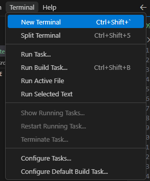
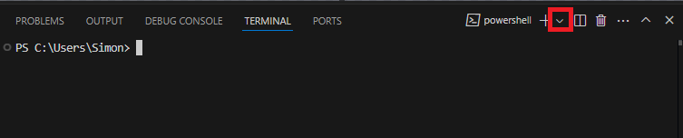

## General tips and tricks to make your life easier.

This guide will provide some useful tips and tricks that have been useful for me while working on
SplashKit.

## Setting Git Bash terminal as default in VS Code

By setting the terminal to Git Bash in VS Code you can compile and run your code without having to
open a new terminal and changing directory to your working directory.

To do this:

1.  Open VS Code
2.  Open a new terminal by pressing ``Ctrl + Shift + ` `` or Terminal tab -> new terminal
    
3.  In the terminal, locate the small drop down arrow to the top right
    
4.  In the drop down menu click "Select Default Profile"
    
5.  You should see a drop down menu at the top of the window with a list of terminals where you can
    select Git Bash or your terminal of choice. 
6.  Select the terminal you would like as the default terminal within VS Code. I recommend Git Bash

By following these steps, VS Code will automatically open an embedded terminal in your working
directory. No more alt-tabbing when building your SplashKit projects

## Setting up aliases in your Bash terminal

Constantly typing the same lengthy commands can become tedious so by setting up aliases you can save
yourself a bunch of time. Whether it is shortened git commands or a compilation command for C++
aliases are a great time saver.

To create Aliases:

1. Open a new terminal
2. Enter the command `nano ~/.bashrc`
3. In the text editor create the alias you want to use as such:

   - `alias name='command'`

4. Once you have added the aliases you wish to use, to exit the nano editor and save changes press
   `Ctrl + X`
5. When prompted to save changes press `Y` and then `enter`. This should close the editor and take
   you back to the terminal
6. Now to apply the changes enter the command `source ~/.bashrc` or restart your terminal

Now when you enter your alias it should run the command you have set. Some Aliases I use are:

| Aliases                                  | Purpose                                          |
| ---------------------------------------- | ------------------------------------------------ |
| alias gc='git checkout'                  | allows gc branchname for easier branch switching |
| alias gcm='git checkout main'            | quickly get to main branch                       |
| alias skcompile='skm clang++ \*.cpp -o a | quickly compiles C++ SplashKit projects          |

These are some example aliases but you can do pretty much anything. If there are any commands you
find yourself typing and think "Man this is tedious" just make a new alias for it!

## Useful VS Code Extensions

These are some helpful extensions that you can add to VS Code that may help with your workflow

| Extension           | Description                                                                 |
| ------------------- | --------------------------------------------------------------------------- |
| C/C++ and C#        | Syntax highlighting, IntelliSense, and debugging tools.                     |
| IntelliCode         | Offers tools like line autocomplete and code suggestions                    |
| GitHub Pullrequests | Lets you work on existing pull requests in your local developer environment |
| GitLens             | Better Git history and inline blame tools.                                  |
| Prettier            | Automatically Formats your code (doesn't work on all languages)             |
| Code Spell Checker  | Spell checks your code                                                      |

## Enable format on save

Enabling format on save will allow your formatting extensions like Intellisense or prettier to
format your code automatically when you save the document.

To enable this:

1. Go to File -> Preferences -> Settings or `Ctrl + ,`
2. In the search bar type "Format on save"
3. Enable the Format on save box 
