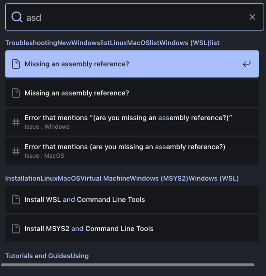

import { Tabs, TabItem, Steps, Aside } from "@astrojs/starlight/components";

Algolia DocSearch is a search engine designed to automatically extract content from Open Source
documentations, allowing it to have an instant search on tech websites.

## Why DocSearch

- It is free and was designed especially for open source projects and technical
  documentations/blogs.
- It already has built-in support for Astro Starlight.
- It is built on Algolia Autocomplete, providing better accessiblity and customizability.
- It offers new features to better the user experience such as search history log, a favorite
  system, and support for Google Analytics Integration.

### How to Get Started

Registration can be done via the [DocSearch Site](https://docsearch.algolia.com/apply) where you'll
need to enter your website URL and email. _(This process could take a few days for approval.)_ Once
approved, you will recieve an email to accept their invitation to get started, where you'll be taken
to the Algolia Dashboard. Further configuration can be made via this Dashboard.

<Aside type="tip">

While working on integrating DocSearch into the SplashKit website, I noticed there was a bug
regarding the `lvl0` heading where it was pulling too much data causing the header to be a jumbled
mess.



This is due to the `lvl0` searching for `span` tags that are contained within the `summary` tags
which is espcially for folders names used in the sidebar. This can be navigated through the Editor
tab and telling the `lvl0` variable to only pull the first match per category.

```js
const lvl0 =
  $('details:has(a[aria-current="page"])').find("summary").find("span").first().text() ||
  "Documentation";
```

By specifying the `.first()` function, it ensures it only returns the main category title.

</Aside>

### Astro Starlight Integration

<Steps>

1. Install `@astrojs/starlight-docsearch`:

   <Tabs syncKey="pkg">

   <TabItem label="npm">

   ```sh
   npm install @astrojs/starlight-docsearch
   ```

   </TabItem>

   <TabItem label="pnpm">

   ```sh
   pnpm add @astrojs/starlight-docsearch
   ```

   </TabItem>

   <TabItem label="Yarn">

   ```sh
   yarn add @astrojs/starlight-docsearch
   ```

   </TabItem>

   </Tabs>

2. Add DocSearch APIs to the Astro Starlight `plugins` config via `astro.config.mjs`:

   ```js
   // astro.config.mjs
   import { defineConfig, squooshImageService } from "astro/config";
   import starlight from "@astrojs/starlight";
   import starlightLinksValidator from "starlight-links-validator";

   export default defineConfig({
     site: "https://splashkit.io/",
     integrations: [
       starlight({
         title: "SplashKit",
         description:
           "SplashKit is a cross-platform game engine for C, C++ and Objective-C. It provides a simple API for 2D game development.",
         plugins: [
           starlightLinksValidator({
             errorOnRelativeLinks: true,
           }),
           starlightDocSearch({
             appId: "DOCSEARCH_API_ID",
             apiKey: "DOCSEARCH_API_KEY",
             indexName: "DOCSEARCH_INDEX_NAME",
           }),
         ],
       }),
     ],
   });
   ```

3. **Optional** Further​ configuration can be done by following guides on the
   <a href="https://starlight.astro.build/guides/site-search/#algolia-docsearch" target="_blank">Starlight
   Documentation</a>.

</Steps>

## Custom Ranking

This following section provides a step-by-step guide to updating the custom ranking system to
prioritize categories during search operations.

### Steps

<Steps>

1. Start off by heading over to the
   <a href="https://dashboard.algolia.com/users/sign_in" target="_blank">Algolia Dashboard</a> .
2. Click on the **Go To Crawler** button and select the crawler you want to adjust.
3. Once in the crawler, go to the **Editor** via the sidebar.
4. Add DocSearch APIs to the Astro Starlight `plugins` config via `astro.config.mjs`:

   ```js
   actions: [
     {
       indexName: "sksearchtest",
       pathsToMatch: ["https://sksearchtest.netlify.app/**"],
       recordExtractor: ({ $, helpers }) => {
         const lvl0 =
           $('details:has(a[aria-current="page"])').find("summary").find("span").first().text() ||
           "Documentation";

         return helpers.docsearch({
           recordProps: {
             lvl0: {
               selectors: "",
               defaultValue: lvl0,
             },
             lvl1: "main h1",
             lvl2: "main h2",
             lvl3: "main h3",
             lvl4: "main h4",
             lvl5: "main h5",
             lvl6: "main h6",
             content: "main p, main li",
             apiBoost: lvl0 === "Developer Documentation" ? 10 : 1,
             usageBoost: lvl0 === "Usage Examples" ? 5 : 1,
           },
           indexHeadings: true,
           aggregateContent: true,
         });
       },
     },
   ];
   ```

5. Inside the `recordProps`, you'll notice two variables: `apiBoost` and `usageBoost`. _These
   variable names can be customized to suit your needs_.
6. The values assigned to these variables represent the boost level. The higher the number, the
   stronger the boost.
7. To change which category receives a boost, simply adjust the name that the condition checks. For
   example, you can modify `"Developer Documentation"` to check for a different category name, such
   as `"Installation"` or `"Tutorials and Guides"`.
8. Once completed, navigate to the **Indices** tab viable the sidebar and select the index you're
   working on.
9. In the Index page, head to the **Configuration** tab in the top navigation bar and select
   **Ranking and Sorting**: 

10. As seen in the image above, place the variables defined in the Editor earlier by clickin the **+
    Add custom ranking attribute** button. The order of priority should follow a top-to-bottom
    sequence, with the top-most being the highest priority. _Note: It is not recommended to place
    these variables above the preset textual ranking, as the preset rankings serve as the core
    foundation of the search engine’s ranking system._

</Steps>
