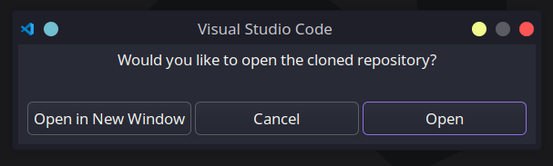
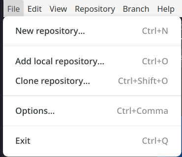

import { Tabs, TabItem } from "@astrojs/starlight/components";

## Get Your Environment Set Up

### Install Necessary Tools

First things first, you'll need to install the necessary tools to get started working within SplashKit.io.
Head to the [SplashKit.io](https://splashkit.io/) website and follow the instructions for your specific
operating system to install SplashKit. Then, head to [Docker](https://docs.docker.com/engine/install/)
and install Docker for your specific operating system. Finally, in your code editor of choice, ensure
you have added the [Astro Extension](https://docs.astro.build/en/editor-setup/) to your editor.

### Fork the SplashKit.io Repo

To get started working within the Starlight repo, you need to first head over to GitHub and make your
own fork of the [SplashKit Repo](https://github.com/thoth-tech/splashkit.io-starlight).


Then, select the fork button and create the fork:


### Steps to Clone the Repo

<Tabs syncKey="github-management">
<TabItem label="Via CLI">
Open a terminal on your machine and run the following commands, making sure to replace `USERNAME`
with your own GitHub username:

```shell
git clone https://github.com/USERNAME/splashkit.io-starlight.git
```

Then, navigate into the directory:

```shell
cd splashkit.io-starlight
git remote add upstream https://github.com/thoth-tech/splashkit.io-starlight.git
```

Now you're all set up to start working on the SplashKit.io repo.

</TabItem>
<TabItem label="Via VSCode">
Open a new VSCode window, and then open the command palette by pressing `cmd + shift + p` (or `ctrl
+ shift + p` on Windows/Linux), then type `git clone` and paste the URL of your forked repo.


When prompted, select the folder location where you want to clone the repo.


Once the repo is cloned, VSCode will prompt you to open the repo folder location.



Now you're all set up to start working on the SplashKit.io repo in VSCode.

</TabItem>
<TabItem label="Via GitHub Desktop">

Open GitHub Desktop and click on the `File` tab in the top-left corner, then select `Clone Repository`.



Here you can either filter via your existing repositories, find the forked repo, or paste the URL
of the forked repo.


Once the repo is cloned, you can open the repo in your preferred code editor.

</TabItem>
</Tabs>

## Create Branches for Contributions

To start contributing to the SplashKit.io repo, you'll need to create a new branch for each contribution.

### Steps to Create a New Branch

<Tabs syncKey="github-management">
<TabItem label="Via CLI">
Move into the SplashKit.io directory and create a new branch:

```shell
git checkout -b your-branch-name
```

Then, push the branch to your fork:
  
```shell
git push origin your-branch-name
```

Now you're all set up to start working on your new branch.

</TabItem>
<TabItem label="Via VSCode">

Open source control by clicking on the icon on the left-hand side of the VSCode window. Then click
on the three dots, go down to `Branch`, and select `Create Branch from`.


Then, select to make the new branch from `master` and name your branch.


Next, push the branch to your fork by clicking on the `Publish Branch` button in source control.


Now you're all set up to start working on your new branch.

</TabItem>
<TabItem label="Via GitHub Desktop">

Select the Starlight repo in GitHub Desktop, then click on the `Current Branch` tab and select `New Branch`.


Name your branch and then click `Create Branch`.


Then push the branch to your fork by clicking on the `Publish Branch` button.


Now you're all set up to start working on your new branch.

</TabItem>
</Tabs>

By creating a new branch for each contribution, you can keep your changes separate from the main branch.
